# Rischi on line \[ROL\]

## Software di mappatura, analisi e gestione dei rischi corruttivi cui possono essere esposti i processi organizzativi in Ateneo

 

    Documentazione di Progetto (SINTETICA)

Diario delle revisioni

| **Release**     | Data                   |Autore|
|-----------------|------------------------|------|
| **Release 0.1** | 23/03/2022             |  TG  |
| **Release 0.2** | 04/05/2022             |  TG  |
| **Release 0.3** | 13/10/2022             |  TG  |
| **Release 0.4** | 14/10/2022             |  TG  |
| **Release 0.5** | 26/06/2023             |  TG  |
| **Release 0.6** | 27/06/2023             |  TG  |
| **Release 0.7** | 19/07/2023             |  TG  |
| **Release 0.8** | 01/09/2023             |  TG  |
| **Release 0.9** | 22/01/2024             |  TG  |
| **Release 1.0** | 24/01/2024             |  TG  |
| **Release 1.1** | 15/02/2024             |  TG  |
| **Release 1.2** | 23/02/2024             |  TG  |
| **Release 1.3** | 27/02/2024             |  TG  |
| **Release 1.4** | 01/03/2024             |  TG  |
| **Release 1.5** | 07/03/2024             |  TG  |
| **Release 1.6** | 08/03/2024             |  TG  |
| **Release 1.7** | 22/04/2024             |  TG  |
| **Release 1.8** | 24/07/2024             |  TG  |
| **Release 1.9** | 01/08/2024             |  TG  |
| **Release 2.0** | 09/01/2025             |  TG  |
| **Release 2.1** | 20/01/2025             |  TG  |
| **Release 2.2** | 11/12/2025             |  TG  |
| **Release 2.3** | 02/03/2026             |  TG  |
| **Release 2.4** | 07/07/2026, 08/07/2026 |  TG  |
| **Release 2.5** | 13/07/2026             |  TG  |

--- 

### **Sommario**

# 

# [Introduzione [4](#introduzione)](#introduzione)

[OBIETTIVO [4](#obiettivo)](#obiettivo)

[PIANIFICAZIONE DEL PROGETTO [4](#pianificazione-del-progetto)](#pianificazione-del-progetto)

# [Contesto applicativo [6](#contesto-applicativo)](#contesto-applicativo)

[I PROCESSI E I RISCHI [6](#i-processi-e-i-rischi)](#i-processi-e-i-rischi)

[L’INTERVISTA [7](#lintervista)](#lintervista)

[IL QUARTO LIVELLO DI DESCRIZIONE DEI PROCESSI [11](#il-quarto-livello-di-descrizione-dei-processi)](#il-quarto-livello-di-descrizione-dei-processi)

[AMBITI DI ANALISI GENERICI E SPECIFICI [15](#ambiti-di-analisi-generici-e-specifici)](#ambiti-di-analisi-generici-e-specifici)

[I FATTORI ABILITANTI [16](#i-fattori-abilitanti)](#i-fattori-abilitanti)

[GLI INDICATORI DI RISCHIO [18](#gli-indicatori-di-rischio)](#gli-indicatori-di-rischio)

[Disposizioni con ripetizione - D'(n,k) [21](#disposizioni-con-ripetizione---dnk)](#disposizioni-con-ripetizione---dnk)

[LE MISURE [24](#le-misure)](#le-misure)

[I NUOVI ATTORI [25](#i-nuovi-attori)](#i-nuovi-attori)

[1. la misura di riduzione del rischio [25](#la-misura-di-riduzione-del-rischio)](#la-misura-di-riduzione-del-rischio)

[2. l’indicatore di monitoraggio [25](#lindicatore-di-monitoraggio)](#lindicatore-di-monitoraggio)

[3. la tipologia della misura [25](#la-tipologia-della-misura)](#la-tipologia-della-misura)

[LA MISURA DI PREVENZIONE DEL RISCHIO CORRUTTIVO [25](#la-misura-di-prevenzione-del-rischio-corruttivo)](#la-misura-di-prevenzione-del-rischio-corruttivo)

[TIPOLOGIA [26](#tipologia)](#tipologia)

[CARATTERE [26](#carattere)](#carattere)

[SOSTENIBILITÀ ORGANIZZATIVA [26](#sostenibilità-organizzativa)](#sostenibilità-organizzativa)

[SOSTENIBILITÀ ECONOMICA [27](#sostenibilità-economica)](#sostenibilità-economica)

[RELAZIONE VERSO LA STRUTTURA [27](#relazione-verso-la-struttura)](#relazione-verso-la-struttura)

[VISTA DELL’IMPLEMENTAZIONE [31](#vista-dellimplementazione)](#vista-dellimplementazione)

[1. REGISTRO DELLE MISURE [31](#registro-delle-misure)](#registro-delle-misure)

[2. ASSOCIAZIONE TRA MISURA E RISCHIO [35](#associazione-tra-misura-e-rischio)](#associazione-tra-misura-e-rischio)

[IL PxI DEI RISCHI [38](#il-pxi-dei-rischi)](#il-pxi-dei-rischi)

[CONCLUSIONI [39](#conclusioni)](#conclusioni)

[ALGORITMI DI MITIGAZIONE E RICALCOLO [43](#algoritmi-di-mitigazione-e-ricalcolo)](#algoritmi-di-mitigazione-e-ricalcolo)

[OBIETTIVO [43](#obiettivo-1)](#obiettivo-1)

[L’ALGORITMO DI CONTENIMENTO (O MITIGAZIONE) DEL RISCHIO [44](#lalgoritmo-di-contenimento-o-mitigazione-del-rischio)](#lalgoritmo-di-contenimento-o-mitigazione-del-rischio)

[L’ALGORITMO DI RICALCOLO [48](#lalgoritmo-di-ricalcolo)](#lalgoritmo-di-ricalcolo)

[VISTA DELL’IMPLEMENTAZIONE [51](#vista-dellimplementazione-1)](#vista-dellimplementazione-1)

[3. REPORT PxI DEI RISCHI (E DELLE MISURE) [51](#report-pxi-dei-rischi-e-delle-misure)](#report-pxi-dei-rischi-e-delle-misure)

[4. TABELLA DELLE MISURE [53](#tabella-delle-misure)](#tabella-delle-misure)

[IL MONITORAGGIO [55](#il-monitoraggio)](#il-monitoraggio)

[I NUOVI ATTORI [55](#i-nuovi-attori-1)](#i-nuovi-attori-1)

[• la fase di attuazione [55](#la-fase-di-attuazione)](#la-fase-di-attuazione)

[• la misurazione [55](#la-misurazione)](#la-misurazione)

[L’INDICATORE DI MONITORAGGIO [55](#lindicatore-di-monitoraggio-1)](#lindicatore-di-monitoraggio-1)

[LA FASE DI ATTUAZIONE [57](#la-fase-di-attuazione-1)](#la-fase-di-attuazione-1)

[MISURA E MISURAZIONE [59](#misura-e-misurazione)](#misura-e-misurazione)

[COMPLETEZZA DEL MONITORAGGIO [60](#completezza-del-monitoraggio)](#completezza-del-monitoraggio)

[ALGORITMO DELL’APPLICAZIONE DEL MONITORAGGIO [62](#algoritmo-dellapplicazione-del-monitoraggio)](#algoritmo-dellapplicazione-del-monitoraggio)

# [Flusso informativo [66](#flusso-informativo)](#flusso-informativo)

[WORKFLOW DI INSERIMENTO MACRO/PROCESSO [66](#workflow-di-inserimento-macroprocesso)](#workflow-di-inserimento-macroprocesso)

[SCELTA LIVELLO DI PROCESSO [67](#scelta-livello-di-processo)](#scelta-livello-di-processo)

[INSERIMENTO MACRO/PROCESSO [67](#inserimento-macroprocesso)](#inserimento-macroprocesso)

[INSERIMENTO INPUT [68](#inserimento-input)](#inserimento-input)

[INSERIMENTO FASI [69](#inserimento-fasi)](#inserimento-fasi)

[STORICIZZAZIONE [73](#storicizzazione)](#storicizzazione)

[STORICIZZAZIONE DEI PXI [75](#storicizzazione-dei-pxi)](#storicizzazione-dei-pxi)

[STORICIZZAZIONE DELLE MISURE [76](#storicizzazione-delle-misure)](#storicizzazione-delle-misure)

[STORICIZZAZIONE DEGLI INDICATORI DI MONITORAGGIO [77](#storicizzazione-degli-indicatori-di-monitoraggio)](#storicizzazione-degli-indicatori-di-monitoraggio)

[ADEGUAMENTO DELLA REPORTISTICA [78](#adeguamento-della-reportistica)](#adeguamento-della-reportistica)

Aggiornato il: 14/07/2026

# 

# Introduzione

Questo documento rappresenta una sintesi della documentazione relativa alla realizzazione di un sistema software per la mappatura dell’esposizione dei processi organizzativi relativamente al rischio corruttivo e relativo trattamento.

### OBIETTIVO 

Il rischio corruttivo è una delle dimensioni significative in cui i processi organizzativi possono essere inquadrati.

Una funzione classica della mappatura dei processi organizzativi è quella di fornire una rappresentazione “plastica” delle allocazioni delle quote parte di lavoro erogate sulle attività di processo, e quindi fornire specifici indicatori di efficienza ed efficacia dei singoli processi ed offrire una base su cui possono essere appoggiate decisioni di revisione e razionalizzazione dell’organizzazione stessa.

Tuttavia, uno degli aspetti più significativi di un progetto di mappatura dei processi consiste **nell’analisi del rischio corruttivo** cui i processi stessi sono esposti: avendo costruito un dizionario dei processi, ed avendo rappresentato *l’effort* dell’organizzazione in termini di quote parte lavorate sui processi stessi, completare il quadro con i tasselli relativi alla dimensione del rischio corruttivo cui i processi sono esposti consente di arricchire la mappatura dei processi con una dimensione di rilevante significato - ancor più importante per l’istituzione pubblica, che deve rendere conto anche al cittadino della modalità in cui i fondi e le sovvenzioni pubbliche vengono impiegate e delle contromisure messe in atto dall’organizzazione stessa per far fronte al rischio di infiltrazioni, in particolare su processi organizzativi a questo punto identificati come sensibilmente esposti al rischio.

### PIANIFICAZIONE DEL PROGETTO 

La schematizzazione dei lavori prevede di procedere attraverso una serie di step:

> i\. Analisi e sviluppo delle funzionalità di mappatura dei processi organizzativi e delle strutture di organigramma

ii\. Analisi e sviluppo delle funzionalità di mappatura dei rischi corruttivi e della loro associazione con i processi mappati e i fattori abilitanti

> iii\. Implementazione del sistema software per la memorizzazione delle risposte date alle domande che indagano il rischio corruttivo e per il calcolo dei livelli di rischio ai processi, sulla base delle risposte date (algoritmi di calcolo del rischio corruttivo)
>
> iv\. Effettuazione del censimento, costituito da una serie di interviste, effettuate con gli uffici amministrativi, per raccogliere le risposte che permettono di ricostruire una mappa dei livelli di rischio cui i processi presidiati dalle strutture intervistate sono esposti.  
>   
> v. Analisi e sviluppo delle misure di mitigazione e del loro impatto sui livelli di rischio (algoritmi di stima della mitigazione)  
>   
> vi. Analisi e sviluppo del sistema di monitoraggio (algoritmi di riduzione effettiva dei livelli di rischio)  
>   
> vii. Implementazione della storicizzazione  
>   
> viii. Effettuazione del monitoraggio annuale
>
> Tali step non sono necessariamente sequenziali ma vengono applicati tramite un modello di sviluppo incrementale.

# Contesto applicativo

## I PROCESSI E I RISCHI

## 

All’inizio dell’analisi, si è tentato a lungo di rendere la mappatura dei processi finalizzata alla valutazione del rischio – cioè la mappatura realizzata tramite questo progetto ROL – compatibile con la mappatura già esistente, realizzata a fini di efficientamento; a tal scopo sono stati anche predisposti degli specifici connettori.

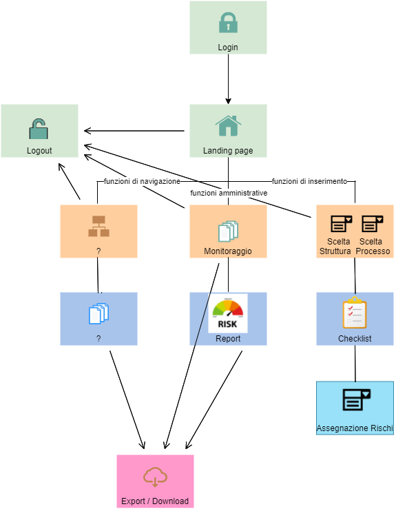

Tuttavia, dopo un’attenta analisi della mappatura esistente, si è ritenuto che fosse necessario creare un nuovo dizionario dei processi, dal momento che il precedente dizionario, basato sul progetto *Good Practice*, non si attagliava bene al contesto della valutazione dei processi in rapporto al rischio corruttivo.

Il dizionario dei processi organizzativi esistente nasceva infatti con lo scopo di mappare l’attività dell’organizzazione al fine di tracciare e “fotografare” l’attività prodotta dagli uffici, mentre il progetto della mappatura dei processi in rapporto al rischio corruttivo può richiedere l’approfondimento di specifici aspetti, quindi di spacchettare magari quello che era un macroprocesso organizzativo in più macroprocessi distinti; pertanto, il dizionario dei processi rispetto al rischio corruttivo risulta trasversale e “incompatibile” rispetto a quello dei processi organizzativi.

Di conseguenza, pur partendo ed ereditando il database dei processi esistenti, è stato necessario creare ulteriori entità, con lo scopo di memorizzare un nuovo dizionario, peraltro articolato su una granularità a 3 livelli (macroprocesso, processo e sottoprocesso) - cui si aggiunge un ulteriore aggregatore: l’area di rischio - piuttosto che su due, come nella mappatura dei processi organizzativi esistente.

Di più, è stato previsto addirittura un ulteriore livello, quello delle attività, o fasi, che sono trasversali a processi e sottoprocessi.

Il connettore tra i processi dell’anticorruzione e quelli organizzativi cui si faceva riferimento sopra è costituito da un’apposita entità debole associativa, in cui ogni riga è costituita dall’identificativo del sottoprocesso organizzativo cui corrisponde l’identificativo del sottoprocesso della mappatura anticorruttiva.

### L’INTERVISTA

Dopo aver caricato le strutture di organigramma ed effettuato la mappatura dei processi, si passa all’intervista (o audit), costituita da una serie di quesiti rivolti alle strutture che erogano i processi; le risposte ai quesiti, volte a investigare il modo in cui i processi stessi vengono salvaguardati e monitorati rispetto al rischio corruttivo, vengono “macinate” da specifici algoritmi di calcolo del rischio, producendo i valori di rischio ottenuti dal processo su specifici indicatori.

Per effettuare un audit, si identifica anzitutto la struttura intervistata e il processo di cui si vuole quantificare l’esposizione al rischio, tramite un apposito wizard (v. Figura 2).

Il gestore dell’intervista, che raccoglie le informazioni, identifica la struttura che sta intervistando e il processo o il sottoprocesso esaminato (non è sufficiente identificare il macroprocesso ma è necessario scegliere almeno un processo). Quindi clicca su Invio.

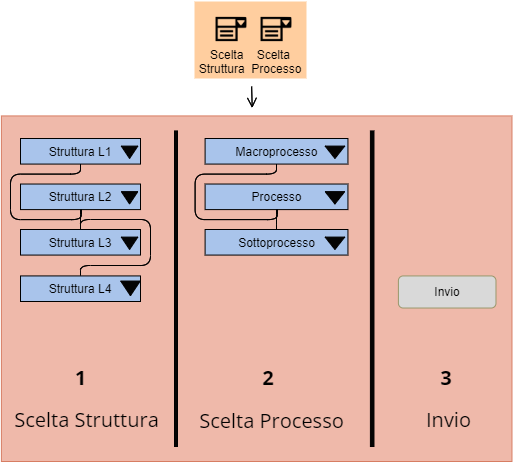

Questa azione produce la generazione dei quesiti, raggruppati in ambiti di analisi (v. Figura 3).

A questo punto, l’intervistatore deve rivolgere almeno una parte di questi quesiti al responsabile di struttura intervistato, e riportare le risposte fornite.

Per ogni quesito, inoltre, è compilabile facoltativamente un campo note.

Ogni volta che si procede ad effettuare un’intervista con una struttura, l’applicazione mostra al gestore tutti i quesiti, **non soltanto un sottoinsieme**. Potrebbe, infatti, verificarsi che, nel corso dell’intervista, alcune riposte o commenti dell’intervistato, riportati poi nelle note dal gestore, attivino l’attenzione del gestore su aspetti che in precedenza non aveva pensato di investigare, ma che si rende conto che è opportuno invece approfondire. Pertanto, i quesiti mostrati sono ad ogni intervista l’elenco completo, ma tuttavia non è obbligatorio rispondere a tutti.

Dal punto di vista dello schema logico, l’entità *quesito* è collegata a tre enumerativi dinamici:

- il primo è l’ambito di analisi (l’argomento, ovvero una semplice “tag” del quesito, in base al quale i quesiti stessi possono essere raggruppati nella pagina in riquadri, colori, etc.);

- il secondo è il tipo di quesito.

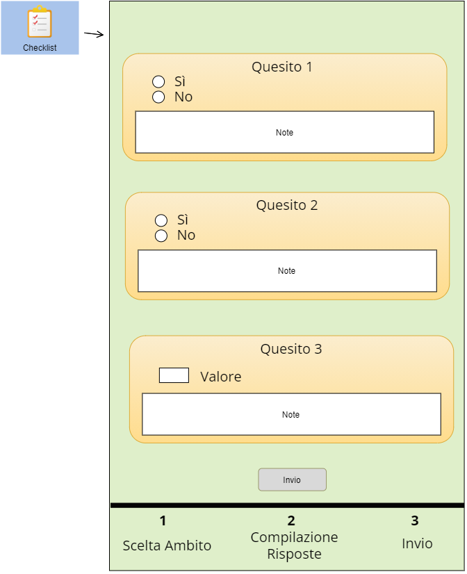

Possono esistere, infatti, svariati tipi di quesiti.

Il primo tipo è rappresentato da quesiti di tipo “On/Off”, ovvero “Si/No”, vale a dire quesiti misurabili su scala nominale: la tipologia delle risposte a questi quesiti sarà quindi di tipo qualitativo.

Ad esempio: *“Si sono verificati fino ad oggi*[^1] *episodi di Whistleblowing?”*

A questa domanda si può rispondere o “si” oppure “no”, quindi le risposte stesse non sono espresse in termini di “quantità” ma solo di “qualità”.

Un altro tipo di quesiti è rappresentato da quesiti di tipo quantitativo.

P.es., se si chiedesse *“Quanti episodi di Whistleblowing si sono verificati fino ad oggi?”* la risposta sarebbe costituita da un numero appartenente ad N (l’insieme dei numeri naturali); quindi questa risposta è misurabile su una scala a rapporti.

Un ulteriore tipo di quesito è rappresentato da domande che necessitano di una risposta descrittiva.

- Il terzo enumerativo dinamico cui è collegato il quesito è la “formulazione del quesito”. Nella figura seguente viene riportata la struttura di questa entità.

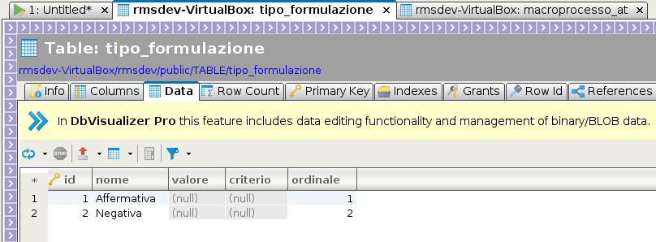

La formulazione del quesito esprime il “verso” dell’identificazione di un dato rischio da parte di un dato quesito.

Questo dato è necessario perché una stessa risposta può identificare un rischio alto o un rischio basso a seconda di come è formulata la domanda.

Ad esempio: il quesito:

*“Si sono verificati in passato provvedimenti disciplinari legati a comportamenti che hanno esposto al rischio corruttivo?”*

è un quesito di tipo “Vero/Falso” (quindi si risponde o sì o no). Se si risponde sì, il quesito è fortemente identificante un rischio corruttivo, perché è evidente che se in passato ci sono stati episodi del genere, c’è da aspettarsi che se ne possano verificare ulteriori. Quindi la “quota parte” di identificazione di un dato rischio sarà alta (p.es. 80%). Ma per capire se è la risposta “sì” o la risposta “no” quella che fa scattare il rischio, bisogna guardare come è formulato il quesito; p.es. questo quesito è formulato in modo affermativo, cioè la formulazione che identifica il rischio è la risposta sì (p.es. “id_formulazione_identificante” = 1).

Invece, al quesito:

*“Il processo è sottoposto al vaglio di due distinti soggetti verificatori?”*

sarà la risposta “no” a far scattare il rischio, cioè la risposta negativa, perché la risposta che fa scattare l’allarme è la risposta “no”, non la risposta “si”.

Quindi la formulazione del quesito è indicativa di quale è la risposta (o l’ammontare, nel caso di quesiti con risposta numerica) collegata al rischio.

L’identificazione del rischio dalla risposta in funzione del modo in cui è formulata la domanda vale infatti anche per quesiti di tipo quantitativo.

Ad esempio, se il quesito fosse:

*“Quanti soggetti verificatori controllano il processo dal punto di vista del rischio corruttivo?”*

la risposta che fa scattare l’allarme sarebbe 0 mentre 1 potrebbe far scattare un rischio moderato, mentre 2 potrebbe correlare la risposta a un rischio basso.

Una volta compilati tutti i quesiti, o comunque quelli che il gestore ritiene opportuno rivolgere, il gestore avvia il workflow di calcolo in tempo reale del rischio, scatendando gli algoritmi di calcolo dei valori degli indicatori di rischio.

### IL QUARTO LIVELLO DI DESCRIZIONE DEI PROCESSI

In precedenza è stata esaminata la strutturazione dei processi censiti dall’anticorruzione determinandone 3 livelli:

- macroprocesso

- processo

- sottoprocesso

Tuttavia vi è un quarto livello che bisogna sicuramente rappresentare e che corrisponde alle fasi (anche chiamate “attività”) in cui i processi (ed eventualmente i sottoprocessi) si articolano.

Nella letteratura sulla mappatura dei processi, normalmente le fasi costituiscono un’ulteriore specificazione di dettaglio dell’ultimo livello di descrizione dei processi, quindi, nel caso specifico, dovrebbero essere l’articolazione interna dei sottoprocessi. Siccome, tuttavia, nel dizionario dei processi censiti a fini anticorruttivi i sottoprocessi sono stati previsti ma non identificati fin da subito, si è deciso di procedere associando le fasi sia ai processi sia ai sottoprocessi, in modo ortogonale.

Una singola fase deve avere almeno un processo associato (altrimenti non avrebbe senso la sua esistenza) e, al più, può essere associata ad un solo processo (vi possono essere fasi aventi lo stesso nome, ma si tratta in tal caso di semplici omonimie).

Il processo censito dall’anticorruzione, dal canto suo, può avere nessuna o molte fasi associate.

(Stesso tipo di relazione sussiste tra la fase ed il livello di maggior dettaglio, ovvero il sottoprocesso censito con finalità anticorruttiva. Nel contesto di questa analisi - tranne ove specificamente indicato - il termine “processo” è utilizzato per designare, indifferentemente, processi e sottoprocessi censiti a fini anticorruttivi).

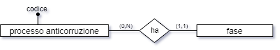

Per quanto riguarda invece il livello di aggregazione maggiore, non è stata stabilita la possibilità di strutturare in fasi un **macroprocesso** perché questo è di livello troppo alto per suddividerlo direttamente in fasi e il suo “spacchettamento” identificherà quindi processi, non fasi.

Un’altra associazione si può avere **tra la fase ed il rischio corruttivo**; è infatti possibile pensare di associare, **facoltativamente**, una specifica fase ad uno specifico rischio corruttivo. A differenza della relazione tra il processo e la fase, quella tra il rischio e la fase è di tipo *n : m* dal momento che non solo uno stesso rischio può essere associato a più fasi, ma anche una specifica fase può essere associata a più rischi. La relazione, quindi, va normalizzata.

La relazione che sussiste **tra la fase e la struttura** ha il compito di mappare quale/i struttura/e interviene/intervengono, in qualità di “struttura erogante”, nell’attuazione della fase.

Su una stessa fase potrebbero contribuire più strutture, mentre su un’altra fase potrebbe non esservi il contributo di alcuna struttura “gregaria” ma solo della struttura “capofila”, ovvero di quella che eroga il processo. Anche in quest’ultimo caso, però, l’associazione va valorizzata, perché non si può assumere a priori che la struttura capofila sia sempre associata a ogni fase di un processo che eroga; una, o più, delle fasi, infatti, potrebbero essere in carico a strutture che non hanno niente a che fare con la struttura che eroga il processo.

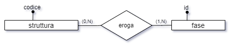

Quindi questa relazione va valorizzata esplicitamente anche per la struttura capofila; in pratica, dal punto di vista della fase non ha senso la distinzione tra struttura capofila e struttura gregaria: una fase deve essere sempre associata ad almeno una struttura, che è quella che la eroga; che poi tale struttura coincida con la struttura che sovrintende al processo o meno, non ha alcun significato a livello dell’associazione tra la fase e la struttura stessa.

Altre entità introdotte sono state l’INPUT e l’OUTPUT. Si tratta degli elementi che, negli schemi classici di mappatura dei processi organizzativi, di tipo ingegneristico, rispettivamente danno origine al processo stesso e rappresentano i risultati prodotti dal processo.

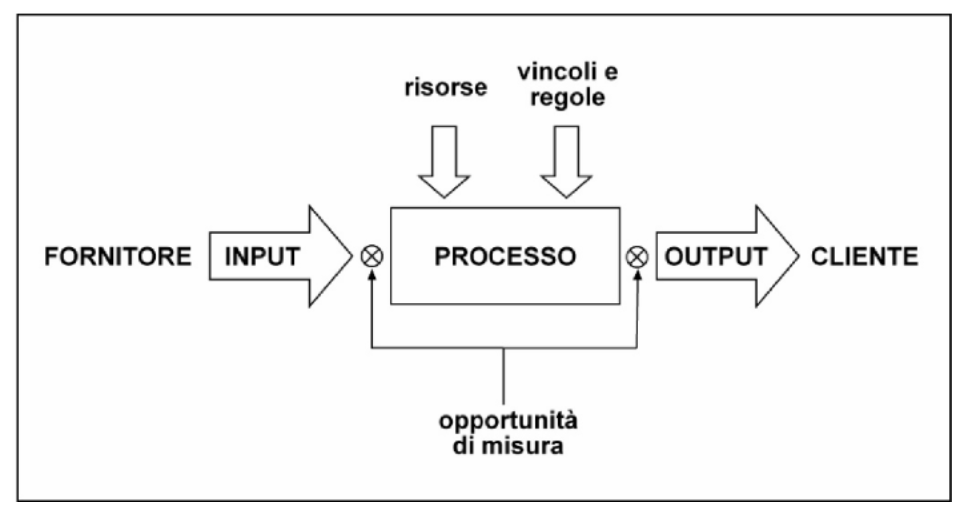

Un input è caratterizzato, oltre che dai normali attributi, da una relazione verso i processi di tipo *n : m*; infatti, non solo uno stesso processo potrebbe essere innescato da più di un input, ma anche uno stesso input potrebbe dare origine a più processi distinti; lo stesso discorso vale per il sottoprocesso. Invece, si è evitato di mappare la associazione tra il macroprocesso e l’input perché gli input dei macroprocessi potrebbero facilmente derivare dall’unione degli input dei loro processi: quindi, mappato il dato con granularità più fine, il dato aggregato potrà essere facilmente ricavato (in sostanza, gli input di un macroprocesso sono l’unione degli input dei suoi processi).

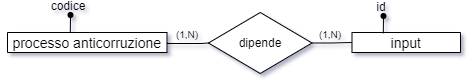

A differenza degli input, che non solo potrebbero concorrere in molti a scatenare uno stesso processo, ma potrebbero essere condivisi tra più processi, **il processo dell’output dev’essere unico**.

Viceversa, uno stesso processo potrebbe produrre più di un risultato, per cui un processo può avere più output contemporaneamente

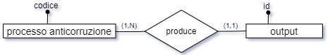

Uno specifico output di uno specifico processo potrebbe fare da input di un altro processo, per cui vi è anche una relazione 1 : 1, facoltativa, tra queste due entità

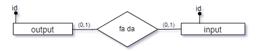

Input e Output sono enumerati in rispettive entità dizionario (registro degli input e registro degli output).

Infatti, gli Input sono in relazione n : m con i processi.

Anche gli Output, pur essendo in linea di massima legati a un solo processo, sono comunque stati implementati utilizzando una tabella di relazione tra output e processo, per cui sia gli input sia gli output vanno riutilizzati (ciò che viene inserito ex-novo è una riga nella relativa relazione).

In altri termini, se un nuovo input da inserire su un processo si chiama come un input precedentemente inserito, va utilizzato l’input precedentemente inserito.

Questo discorso vale anche per gli Output.

NOTA: Tabella Input, campo “interno”, tipo boolean: se *true* implica che l’input proviene da soggetti interni all’ateneo, se *false* da soggetti esterni.

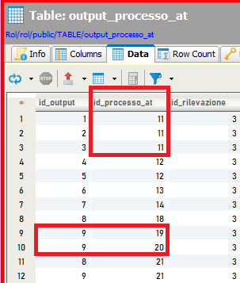

### AMBITI DI ANALISI GENERICI E SPECIFICI

Quando si parla di ambiti di analisi, normalmente si intende ambiti generali (generici), tabella ambito_analisi, che vengono presentati all’intervistatore a prescindere dalla struttura sondata e dal processo scelto.

Tuttavia è possibile implementare un meccanismo che preveda di mostrare solo alcuni ambiti.

La tabella ambito_specifico lega l’ambito di analisi al macroprocesso (e, volendo, anche al processo e al sottoprocesso) in modo che, scegliendo questi elementi, sia possibile visualizzare un contenuto dinamico.

Questo meccanismo non è stato implementato.

### I FATTORI ABILITANTI

I fattori abilitanti sono elementi che concorrono all’individuazione delle misure di contrasto al rischio corruttivo.

Di seguito il registro dei fattori abilitanti alla versione 2.67 dell’applicazione “Rischi On Line”.

Tabella 1: Il registro dei fattori abilitanti

| **FATTORI ABILITANTI**                                                                                         |
|----------------------------------------------------------------------------------------------------------------|
| alterazione, manipolazione e utilizzo improprio di informazioni e documentazione                               |
| eccessiva regolamentazione e scarsa chiarezza della normativa di riferimento                                   |
| esercizio prolungato ed esclusivo della responsabilità di un processo da parte di pochi o di un unico soggetto |
| inadeguata diffusione della cultura della legalità                                                             |
| inadeguatezza o assenza di competenze del personale                                                            |
| mancanza di controlli                                                                                          |
| mancanza di misure di prevenzione del rischio                                                                  |
| mancanza di strumenti informatici                                                                              |
| mancanza di trasparenza                                                                                        |
| scarsa responsabilizzazione interna                                                                            |
| uso improprio o distorto della discrezionalità                                                                 |
| procedure interne poco efficienti                                                                              |

I fattori abilitanti sono elementi descrittivi, poco variabili nel tempo; per questo motivo non necessitano né di un codice univoco, né di una storicizzazione; quindi l’entità “fattore_abilitante” avrà semplicemente un id e un nome e non dipenderà dalla rilevazione, e quindi sarà un’entità forte.

Per quanto riguarda, invece, la relazione tra i fattori abilitanti, i rischi ed i processi, la situazione è più complessa. È necessario generare una **relazione ternaria**, dal momento che il significato dell’associazione tra il fattore abilitante ed il processo è contestuale al rischio e non può essere considerata indipendentemente da questo (e viceversa).

In altri termini, non è possibile associare un fattore abilitante ad un rischio e desumere i processi associati al fattore abilitante da quelli associati al rischio.

Ricavare i processi associati al fattore abilitante dai processi già associati al rischio connesso al fattore stesso non permette di ottenere la granularità sufficiente per rappresentare il dato di realtà.

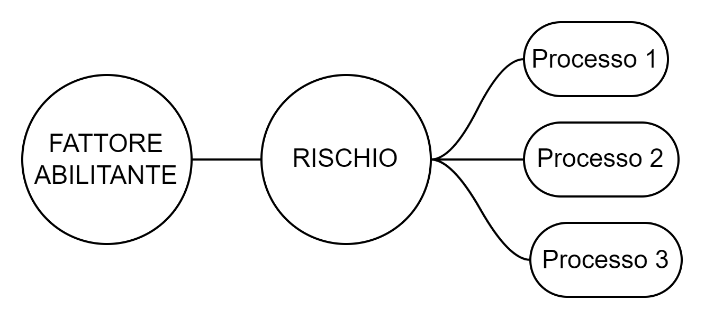

Infatti, nel contesto di un dato processo, un dato fattore abilitante potrebbe essere associato ad un rischio cui il processo è esposto ma non ad un altro. Un esempio della situazione da rappresentare è quindi simile al seguente:

Tabella 2: Esempio di associazioni tra rischi e fattori abilitanti nel contesto di un dato processo

<table>
<colgroup>
<col style="width: 49%" />
<col style="width: 50%" />
</colgroup>
<thead>
<tr class="header">
<th colspan="2"><strong>PROCESSO 1</strong></th>
</tr>
</thead>
<tbody>
<tr class="odd">
<td>RISCHIO 1</td>
<td>FA 1</td>
</tr>
<tr class="even">
<td>RISCHIO 2</td>
<td>
FA1

FA2
</td>
</tr>
<tr class="odd">
<td>RISCHIO 3</td>
<td>
FA3

FA4
</td>
</tr>
<tr class="even">
<td>RISCHIO 4</td>
<td>-</td>
</tr>
</tbody>
</table>

Nell’esempio, ci troviamo nel Processo 1; esso è esposto a 4 rischi corruttivi;

- il rischio 1 è associato al fattore abilitante 1;

- il rischio 2 è associato al fattore abilitante 1 (di nuovo) e anche al fattore abilitante 2;

- il rischio 3 è associato ai fattori abilitanti 3 e 4

- il rischio 4 non è associato (ancora) ad alcun fattore abilitante.

Queste associazioni tra rischio e fattore abilitante sono contestuali al processo 1, ma nel processo 2, anche in presenza dei medesimi rischi, la situazione potrebbe essere totalmente diversa.

Occorre quindi una granularità molto fine nell’associazione tra rischio e fattore abilitante, che tenga conto del processo, perché tale associazione dipende da questi tre elementi.

Deve essere quindi disegnata una relazione ternaria.

Nell’analisi, era stata considerata la possibilità che uno stesso fattore abilitante non potesse essere ripetuto su più rischi nello stesso processo, ma poi questo vincolo è stato scartato perché poco sensato. Il vincolo inserito nella relazione, quindi, è solo sulla terna.

### GLI INDICATORI DI RISCHIO

Lo scopo finale dell’intervista su un processo - cioè della raccolta delle risposte date dal personale di una struttura a quesiti declinati su uno specifico processo - è quello di ottenere un indice sintetico che esprima il rischio corruttivo cui tale processo è esposto. Questo indice sintetico si chiama “pi per i” (P x I), talvolta detto, per estensione, “giudizio sintetico” (in realtà il “giudizio sintetico” dovrebbe includere, in \[ROL\], anche una motivazione testuale).

Tale indice sintetico è una sintesi di vari indici intermedi che concorrono a tale valore complessivo.

Questi indici intermedi vengono calcolati come misure di rispettivi indicatori di rischio, i quali dipendono a loro volta da un sottoinsieme dei quesiti.

Riepilogando:

vari sottoinsiemi di quesiti concorrono al valore di altrettanti indicatori.

Il valore di ogni indicatore è funzione dalle risposte che sono state date ai quesiti corrispondenti nel contesto di una o più interviste.

I valori degli indicatori concorrono al valore finale, o generale, del livello di rischio cui è esposto un determinato processo (P x I).

Esistono due tipologie di indicatori:

- indicatori di probabilità (P)

- indicatori di impatto (I)

I primi fanno riferimento a quanto è probabile che l’evento dannoso si verifichi mentre i secondi fanno riferimento a quanto è grave l’evento dannoso se si verifica.

Il giudizio sintetico incrocia questi due valori (P x I).

Per poter calcolare gli indici intermedi, bisogna controllare il valore ottenuto dalle risposte a specifici quesiti; ogni indicatore si basa su un insieme di quesiti specifico e diverso da quello di ogni altro indicatore. A seconda del numero di quesiti coinvolti e dalla tipologia di riposte, si ottiene un algoritmo di calcolo specifico per ciascun indicatore.

A titolo di esempio viene riportato, in pseudolinguaggio, l’algoritmo di calcolo del primo indicatore di probabilità (P1):

Se la risposta al quesito con ID 20 è negativa, il rischio è basso.

Altrimenti, se essa è positiva, bisogna controllare la risposta al quesito 21;

Se il valore di tale risposta è inferiore al 100%, allora il rischio è medio,

Altrimenti, se è 100% il rischio diventa alto.

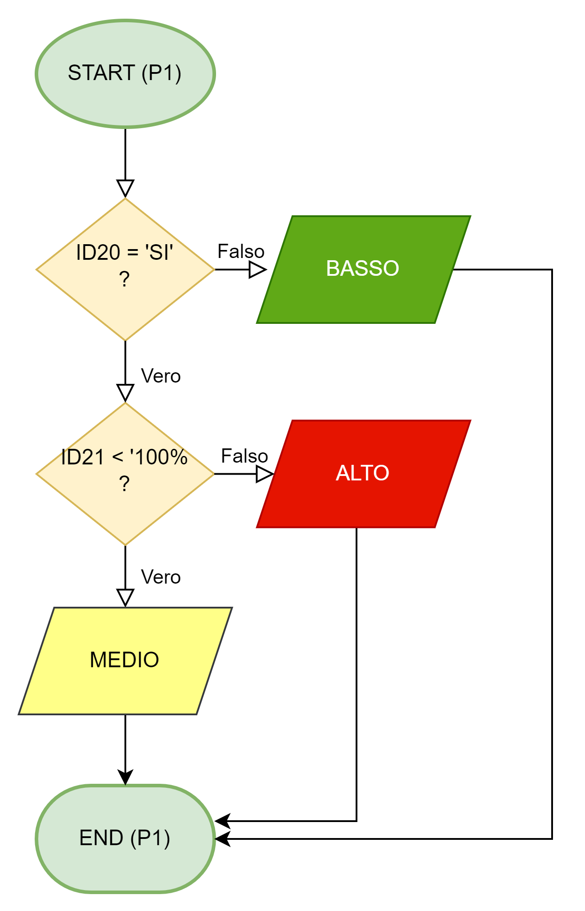

Alcuni algoritmi sono più complessi da calcolare (e quindi implementare) che altri.

Di seguito viene mostrata la tabella che permette di determinare i livelli di rischio dell’indicatore P4

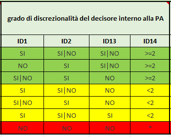

I casi mappati per l’indicatore P4 (test effettuati sull’implementazione dell’algoritmo) sono riportati nella tabella seguente:

ID1 ID2 ID13 ID14 RESULT

disposizioni 1a riga

SI SI SI \>=2 BASSO

SI SI NO \>=2 BASSO

SI NO SI \>=2 BASSO

SI NO NO \>=2 BASSO

disposizioni 2a riga

NO SI SI \>=2 BASSO

NO SI NO \>=2 BASSO

disposizioni 3a riga

SI SI NO \>=2 BASSO

NO SI NO \>=2 rientra nelle combinazioni 2a riga (BASSO)

disposizioni indecidibili

NO NO SI \>=2 NON DETERMINABILE

--------------------------------------------------------------------

disposizioni 4a riga

SI SI NO \<2 MEDIO

SI NO NO \<2 MEDIO

disposizioni 5a riga

SI SI NO \<2 rientra nelle combinazioni 4a riga (MEDIO)

NO SI NO \<2 MEDIO

disposizioni 6a riga

SI SI SI \<2 MEDIO

SI NO SI \<2 MEDIO

--------------------------------------------------------------------

disposizioni 7a riga

NO NO NO \* ALTO

A livello di implementazione, la procedura per il calcolo è la seguente:

- per ogni indicatore si estraggono i quesiti collegati;

- nel contesto di un’intervista, si esaminano le risposte ai quesiti in base all’algoritmo di calcolo (valutando anche eventuali valori spuri, che non permettono di determinare il livello di rischio per l’indicatore considerato);

- nel contesto di un processo, si esaminano i valori di rischio ottenuti per ciascuno dei 7 + 4 indicatori attraverso tutte le interviste che hanno coinvolto il processo stesso, adottando un approccio prudente (“in dubio pro peior”) in caso si siano ottenuti livelli di rischio contrastanti nello stesso indicatore in interviste differenti;

- nel contesto di un processo, si ottengono quindi gli indici sintetici di P e di I e si applica uno specifico algoritmo per il calcolo del P x I.

Considerando che P ed I hanno ciascuno 3 valori possibili, matematicamente il calcolo degli incroci dei valori di P e dei valori di I è il calcolo delle disposizioni (con ripetizione) di 3 elementi presi a 2 a 2.

## 

#### Disposizioni con ripetizione - D'(n,k)

**Definizione**.

Dati *n* elementi distinti e un numero *k\<=n* si dicono disposizioni con ripetizione di questi *n* elementi, presi a *k* a *k* (o di classe *k*), **D'(n,k)**, tutti i gruppi che si possono formare con gli elementi dati, in modo che:

- ogni gruppo contenga *k* elementi non necessariamente distinti

- ogni elemento possa trovarsi ripetuto nel gruppo fino a *k* volte

- due gruppi qualunque differiscano fra loro per qualche elemento oppure per l'ordine in cui gli elementi sono disposti

**Esempi**.

Le disposizioni con ripetizione di 3 elementi (abc) presi a 2 a 2 sono:

aa ab ac ba bb bc ca cb cc

**Calcolo delle disposizioni con ripetizione**.

D'(*n*,*k*) = *nk*

## 

Nel nostro caso abbiamo 3 elementi (alto, medio, basso) presi a 2 a 2, da cui:

*D’(3,2) = 32 = 9*

Di seguito viene riportata la tabella di decisione dell’algoritmo per il calcolo del PxI, con i 9 valori possibili derivanti dalle disposizioni con ripetizione dei 3 valori possibili del P e dei 3 valori possibili di I.

| P     | I     | P x I     |
|-------|-------|-----------|
| ALTO  | ALTO  | ALTISSIMO |
| ALTO  | MEDIO | ALTO      |
| ALTO  | BASSO | MEDIO     |
| MEDIO | ALTO  | ALTO      |
| MEDIO | MEDIO | MEDIO     |
| MEDIO | BASSO | BASSO     |
| BASSO | ALTO  | MEDIO     |
| BASSO | MEDIO | BASSO     |
| BASSO | BASSO | MINIMO    |

Siccome abbiamo visto che su uno stesso processo possono essere effettuate più interviste, come è possibile assumere che i risultati dei vari indicatori siano univoci per il singolo processo?

In base a quanto analizzato finora, siamo consapevoli che un processo potrebbe essere in carico a più strutture e ciò potrebbe portare a più interviste distinte che investigano lo stesso processo.

Ora, potrebbe accadere che in un’intervista relativa al processo 1 effettuata con la struttura A il valore di un indicatore, p.es. P1, risulti ALTO mentre in un’altra intervista, relativa sempre al processo 1, ma effettuata stavolta con la struttura B, il valore dell’indicatore P1 risulti MEDIO (o anche BASSO)...

Siccome questo può accadere – ed è perfettamente plausibile che accada – in questo caso, si adotta, come accennato in precedenza, l’algoritmo “In dubio pro peior” (nel dubbio si sceglie il caso peggiore, ovvero il valore di rischio più alto); quindi, nell’esempio, si considera che il valore complessivo di P1 per il processo 1 è ALTO (non si effettua una ponderazione ma si prende il valore di rischio più elevato).

Più sotto viene riportato il diagramma di flusso dell’algoritmo adottato in caso di risultati contrastanti *per uno stesso processo* attraverso varie interviste (risultati contrastanti da un’intervista all’altra).

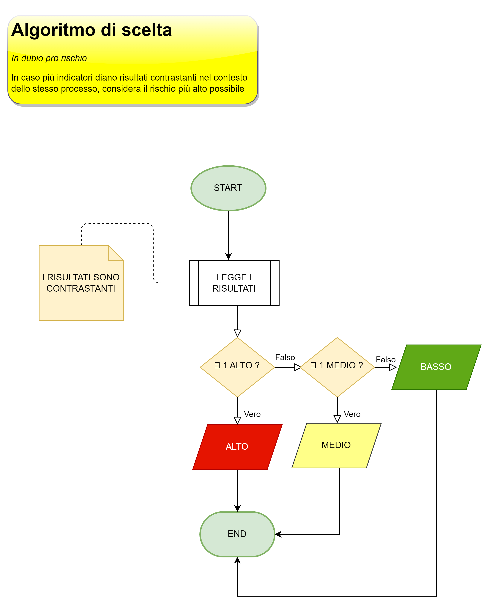

## LE MISURE 

## 

Una buona procedura di gestione del rischio corruttivo prevede non solo l’individuazione delle strutture e dei processi organizzativi maggiormente esposti al rischio corruttivo – che di per sé è già un buon risultato – ma è anche in grado di suggerire la messa in atto di una serie di misure *ad hoc* specifiche per ciascun rischio individuato.

Naturalmente, non si vuol qui sottovalutare l’importanza dell’individuazione e della mappatura dei rischi/processi. Tuttavia questa mappatura è soltanto una **descrizione**, sia pur precisa, replicabile e scientificamente fondata e attendibile, dei rischi corruttivi cui i processi organizzativi sono esposti in seno a un’organizzazione.

Questa descrizione è già di per sé un passo fondamentale per la gestione dei rischi corruttivi, anche perché, tradotta in un sistema informativo, questa mappatura può essere articolata in vari livelli di granularità e può essere tradotta in vari output, testuali, tabellari e/o grafici; inoltre, permette la ri-aggregazione delle informazioni in molteplici modalità e su molteplici canali di output. Infine, ma non ultimo, vi è l’archiviazione dei dati e la loro consultabilità a piacimento e a distanza di tempo.

Tuttavia, se oltre al calcolo dei rischi in tempo reale, un software per la gestione dei rischi corruttivi offrisse anche una serie di **suggerimenti** circa le misure di riduzione del rischio corruttivo che è opportuno mettere in atto al fine di ridurre una serie di rischi in maniera mirata (ottimizzando quindi le azioni di prevenzione e riduzione del rischio), <u>certamente avrebbe un valore maggiore di un software che si limita a mappare e calcolare i rischi cui ogni processo è esposto.</u>

L’ambizione del software \[ROL\] di gestione dei rischi corruttivi è *non soltanto* quella di agevolare i responsabili anticorruzione nella mappatura e nel calcolo dei rischi, *ma anche* quella di proporre le misure di sicurezza atte a ridurre, in maniera mirata, questi specifici rischi.

Come fare, però? Il suggerimento circa le misure da attuare richiede l’intervento di una nuova serie di protagonisti, che devono essere messi in relazione tra loro e sottoposti a una serie di algoritmi di calcolo, per ottenere un responso mirato e produrre suggerimenti circa l’opportunità delle misure da attuare al fine di massimizzare il risultato in base alla pianificazione di un intervento *mirato*.

In teoria, infatti, sarebbe possibile ridurre il livello di rischio tramite un approccio di tipo “bombardamento a tappeto”: in questo scenario, il responsabile dell’AT (Anticorruzione e Trasparenza) propone di inserire tutta una serie di ridondanze (p.es. *double check* o *triple check*) che hanno lo scopo di aumentare il livello di controllo e quindi ridurre il livello di rischio. Tuttavia questo approccio, oltre ad essere dispendioso in quanto prevede di aumentare il monte ore di lavoro legato ai controlli, complica anche la filiera di gestione dei processi organizzativi e potrebbe quindi, alla lunga, rivelarsi inefficiente e, addirittura, causare l’introduzione di nuovi rischi, legati alla sovrapposizione dei controlli, laddove questa ridondanza non fosse opportuna e potesse ingenerare confusione.

Una **individuazione** **mirata** delle misure di prevenzione del rischio, invece, consente di intervenire laddove uno specifico intervento, caratterizzato da uno specifico obiettivo e specifiche azioni, serve realmente, ed è quindi uno strumento non solo di efficacia ma anche di efficienza, perché permette di ottenere il massimo del risultato impiegando il minimo delle risorse.

### I NUOVI ATTORI

Le entità che caratterizzano questa fase proattiva atta a individuare le contromisure e lanciare una campagna di riduzione del rischio già individuato, oltre che di prevenzione del rischio non ancora individuato, sono, in primis:

#### la misura di riduzione del rischio

#### l’indicatore di monitoraggio

#### la tipologia della misura

### LA MISURA DI PREVENZIONE DEL RISCHIO CORRUTTIVO

La misura di prevenzione del rischio corruttivo (chiamata anche “misura di riduzione del rischio”, “misura di mitigazione del rischio” o, talvolta, semplicemente, “misura”) è *un’azione che viene messa in atto allo scopo di ridurre e/o prevenire il rischio corruttivo cui specifici processi organizzativi risultano, in atto o potenzialmente, esposti.*

Le misure di prevenzione del rischio sono oggetti attinenti alla fase di **trattamento** del rischio.

Il software \[ROL\], nei primi 70 deploy, è stato focalizzato sulla **mappatura** dei rischi, ovvero sulla raccolta di dati, poi elaborati tramite specifici algoritmi, finalizzati a divenire informazioni utili ad individuare i processi maggiormente esposti al rischio corruttivo, concentrando queste informazioni in uno specifico indice, chiamato P x I, corredato di motivazione, il tutto costituente il “giudizio sintetico” di ogni processo organizzativo, che permette di assegnare un punteggio di rischio a ciascun processo mappato.

Questa mappatura dei rischi cui i processi organizzativi risultano esposti permette di costruire una mappa della forza – e, conseguentemente, della debolezza - di un’organizzazione rispetto al rischio corruttivo.

Una volta individuato il livello di rischio cui ogni processo organizzativo risulta esposto, tuttavia un ulteriore salto di qualità si ottiene passando alla fase di **trattamento** del rischio corruttivo, ovvero alla fase di messa in atto delle contromisure atte a ridurre il rischio stesso.

**Il software \[ROL\] è infatti in grado non soltanto di assegnare un valore di rischio ad ogni processo ma anche di individuare e proporre le contromisure del caso.**

Per poter proporre le misure del caso, bisogna però anzitutto effettuare l’analisi di *cosa* sia esattamente una misura di prevenzione/mitigazione del rischio corruttivo, allo scopo di mapparla nel database sotto forma di entità-relazione e nel software applicativo sotto forma di oggetto con attributi i cui valori possono essere letti, scritti e manipolati tramite specifici algoritmi.

Cerchiamo, quindi, di capire quali sono le caratteristiche e peculiarità di una misura di prevenzione del rischio, al fine di individuarne gli attributi e le relazioni con le altre entità.

#### TIPOLOGIA

Una misura di prevenzione del rischio ha certamente una **tipologia**; quest’ultima è un’entità forte, con cui la misura stessa si relaziona.

La tipologia di una misura può essere varia; p.es.:

- di regolamentazione

- di disciplina del conflitto d’interesse

- di trasparenza

- di prevenzione

etc…

#### CARATTERE

Oltre ad avere una tipologia, una misura ha anche un **carattere**, che può essere:

1.  generale

2.  specifico

Si potrebbe anche considerare un carattere “misto” ma probabilmente quest’ultima sarebbe semanticamente un po’ troppo debole (è un po’ vago un valore che indica che una misura “è un po’ generale e un po’ specifica, un po’ tutte e due, un po’ nessuna”…)

#### SOSTENIBILITÀ ORGANIZZATIVA

Inoltre, una misura va valutata in funzione della sua **sostenibilità organizzativa**: ad esempio, una misura che preveda di coinvolgere, da oggi, tutte le strutture organizzative in misura del 75% delle loro quote parte di lavoro erogate (“obbligo da oggi che i ¾ del lavoro di tutte le strutture dell’organizzazione sia l’attuazione della misura di sicurezza X”) potrà forse (e non è neanche detto) essere potente ed efficace, ma certamente non sarà efficiente, quindi non sarà organizzativamente sostenibile.

La sostenibilità organizzativa può essere calcolata:

1.  valutando l’impatto sulle strutture organizzative (quante strutture vengono coinvolte? Che percentuale di strutture viene impiegata rispetto al totale? Quanta quota parte di lavoro le strutture coinvolte devono erogare per attuare la misura di sicurezza?)

2.  valutando se la misura in questione è già presente e va solo riconfermata, è già prevista, o è una misura totalmente nuova.

Questi due criteri, incrociati in uno specifico algoritmo, possono generare un valore di sostenibilità organizzativa di ogni misura di sicurezza. Pertanto, la sostenibilità organizzativa di una misura è un indice che va calcolato a valle dell’inserimento e dell’applicazione della misura stessa.

#### SOSTENIBILITÀ ECONOMICA

L’altro criterio rispetto al quale va valutata una misura di sicurezza è la **sostenibilità economica**.

Il discorso è analogo a quello della sostenibilità organizzativa: una misura potentissima, che metterebbe al riparo l’organizzazione da (quasi) ogni rischio, potrebbe essere non sostenibile economicamente. P.es., la contrattualizzazione di 100 revisori che vagliano le procedure, i bilanci, che controllano l’operato di ogni settore aziendale, potrebbe portare a una forte riduzione del rischio, ma non sarebbe sostenibile da parte di un’impresa con 10 dipendenti distribuiti tra un settore produttivo (8) e un settore di contabilità (2) - oltre ad essere sostanzialmente *sbagliato* come approccio.

La sostenibilità economica può essere calcolata semplicemente sommando l’esborso in termini di spese (dirette internamente o all’esterno) che l’applicazione della misura comporterebbe.

#### RELAZIONE VERSO LA STRUTTURA

Una misura deve avere una **struttura responsabile** della messa in atto della misura stessa, quindi la misura è in relazione con la struttura:

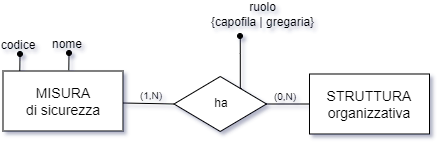

Una misura di sicurezza ha almeno una struttura organizzativa e può averne più di una; mentre una struttura ha zero o più misure di sicurezza (relazione molti-a-molti).

Il ruolo della struttura rispetto alla misura è un attributo della relazione tra la misura e la struttura.

Prima di entrare nel merito dello schema E-R atto a tradurre questa parte del modello, è opportuno fare un esempio, in modo da capire esattamente qual è la situazione che dobbiamo rappresentare.

Poniamo di dover esaminare una misura di sicurezza in rapporto allo scenario.

Per poter fare un’analisi del genere, è necessario esaminare gli attori coinvolti, che nel caso specifico sono: *processo, rischio, fattore abilitante, misura di sicurezza e tipologia di misura.*

*Esempio:*

| PROCESSO         | RISCHIO                | FATTORE ABILITANTE                | MISURA      | TIPOLOGIA DI MISURA |
|------------------|------------------------|-----------------------------------|-------------|---------------------|
| Concorsi per PTA | Conflitto di interesse | Inadeguata cultura della legalità | Linee guida | Regolamentazione    |

Quella riportata sopra è la soluzione che bisogna ingegnerizzare: un processo (CONCORSI) è connesso a una serie di rischi (p.es. CONFLITTO DI INTERESSE), i quali sono a loro volta connessi a una serie di fattori abilitanti… prima di procedere oltre, ricordiamo infatti che il processo organizzativo, censito a fini anticorruttivi, è legato sia al rischio sia al fattore abilitante attraverso una relazione ternaria:

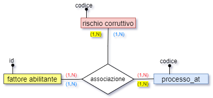

Quindi il processo è associato a uno o più rischi, che a loro volta sono associati a uno o più fattori abilitanti; ma ogni rischio, nel contesto di un dato processo, deve poter essere associato anche a una o più misure di prevenzione, ciascuna delle quali ha una sua tipologia ed un suo carattere.

Ciò delinea una ulteriore relazione ternaria tra processo_at, rischio e misura di prevenzione/riduzione:

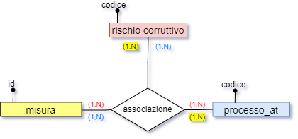

Pertanto, la relazione diretta tra rischio e misura va specializzata con una relazione ternaria tra il rischio, il processo e la misura stessa.

Ciò significa che, da qualunque entità si parta accedendo alla relazione, sarà possibile risalire alle altre entità coinvolte.

**NOTA BENE**

In realtà quelle descritte nell’analisi come relazioni semplici sono già relazioni ternarie e quelle descritte come ternarie nel nostro schema sono tutte relazioni n-arie, in quanto quasi ogni entità dello schema è debole dipendendo dalla rilevazione, e così pure le relazioni stesse.

Tuttavia, nell’analisi trattiamo tutte le relazioni semplici tra entità come se fossero binarie (piuttosto che ternarie come sono in realtà) in quanto l’esistenza di un ulteriore ramo verso la rilevazione è un elemento ricorrente nello schema, cioè comune a tutte le relazioni, e quindi può essere spostato in background nell’analisi descrittiva e, in definitiva, dato per scontato.

Nell’analisi descrittiva, pertanto, il riferimento alla rilevazione normalmente verrà omesso, mentre i vari passaggi daranno evidenza a entità specifiche, per cui si parlerà di relazioni semplici, relazioni ternarie, relazioni 4-arie etc. piuttosto che di relazioni ternarie, relazioni 4-arie, relazioni n-arie.

In questa fase dell’analisi, ci basti dire che anche la misura presenta un ramo verso la rilevazione, in quanto **anche le misure possono essere storicizzate in una rilevazione.**

Il fattore abilitante, dal canto suo, viene associato alla misura tramite la tipologia della misura stessa, che è in relazione diretta con il fattore abilitante stesso.

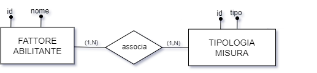

Riepilogando: oltre alle normali relazioni con le entità forti (tipologia, carattere) abbiamo:

- due relazioni ternarie indipendenti ma collegate tra loro tramite il rischio corruttivo;

- una relazione indiretta tra la misura ed il fattore abilitante tramite la tipologia della misura;

- una relazione diretta tra la misura e la struttura, che ha un attributo specificante il ruolo {capofila \| gregaria} che la struttura ha rispetto alla misura.

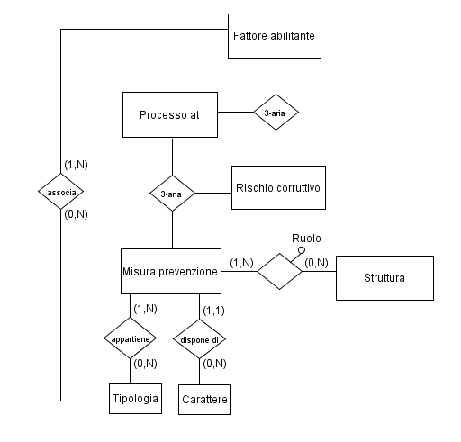

###  

### VISTA DELL’IMPLEMENTAZIONE

Si prevede di implementare due interfacce distinte riguardo alla parte di mappatura delle misure di prevenzione del rischio corruttivo:

1.  il registro delle misure

2.  la funzione di associazione misura-rischio-processo (inserimento tupla 3-aria)

#### 1. REGISTRO DELLE MISURE

Il registro delle misure è composto da una pagina di elenco delle misure già inserite; se non è stata ancora inserita alcuna misura, la pagina è vuota.

Nella pagina c’è un bottone che permette di accedere alla funzionalità di inserimento di una nuova misura.

Il clic su tale bottone aprirà una nuova pagina, contenente la form di inserimento di una misura.

In questa form sono presenti campi obbligatori e un campo facoltativo. Nel mockup riportato in figura 21, i dati obbligatori sono indicati dal grassetto e dall’asterisco; inoltre, nelle scelte da casella a discesa, se una dropdown list è obbligatoria, specifica già Option 1, mentre se è facoltativa di default specifica “-- Nessuna --”.

Per inserire una nuova misura bisogna specificare anzitutto un nome, un carattere ed almeno un tipo; le tipologie della misura possono essere più d’una per una sola misura (cioè una singola misura può riguardare più aspetti e quindi più tipologie).

Quantunque la struttura capofila sia obbligatoria, è possibile per l’utente specificare anche soltanto una struttura di livello 1 (Amministrazione \| Dipartimenti \| Centri) senza specificare sotto-strutture (direzione, area, uo…); in tal caso, la misura si intende relativa non solo alla struttura specificata, ma anche a tutte le strutture figlie della struttura specificata.

Siccome però la granularità dell’associazione tra la misura e la struttura è molto fine, deve essere possibile collegare una misura anche a sottostrutture di strutture diverse, e il numero di queste associazioni non è vincolato in partenza. Per questo motivo, è presente il pulsante “+ Struttura” che permette di specificare una ulteriore struttura associata alla misura.

Il funzionamento della struttura gregaria è identico a quello della struttura capofila, con la differenza che non è obbligatorio specificare questo campo.

Al salvataggio della funzione, verrà ricaricato l’elenco delle misure, in cui sarà visibile la nuova misura appena aggiunta.

La domanda “\[La misura\] comporta spese?” è relativa alla sostenibilità economica, e prevede una scelta obbligatoria tra 3 valori: { SI \| NO \| ND } dove ND sta per “Non Determinabile” (ovvero, non è possibile stabilirlo per chi sta inserendo la misura al momento dell’inserimento della stessa).

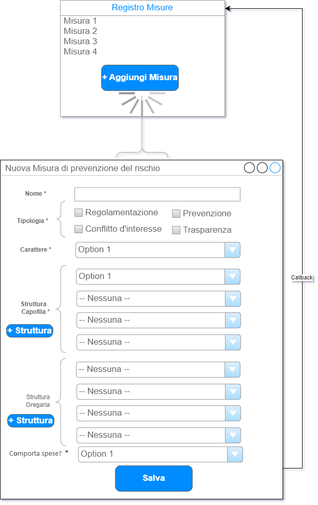

Cliccando sul nome di una misura in elenco, nel registro delle misure, sarà anche possibile visualizzare una pagina dei dettagli di una misura.

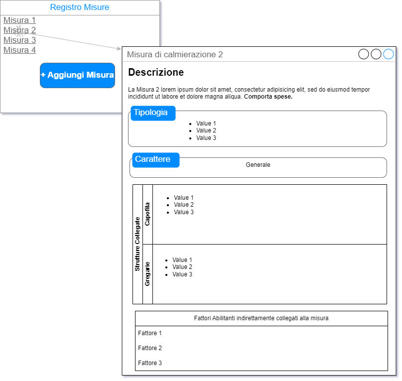

#### 2. ASSOCIAZIONE TRA MISURA E RISCHIO

La funzionalità di associazione tra una misura e un rischio avviene nel contesto di un processo, perché, come anticipato sopra, la granularità richiesta è tale che non è possibile ereditare i processi dai rischi, dal momento che, in tal caso, non sarebbe possibile escludere una parte dei processi stessi o aggiungerne altri collegati ad altri rischi; allo scopo di rappresentare questa granularità è stata prevista una relazione ternaria che collega il processo al rischio e alla misura di prevenzione.

Lato interfaccia, si sceglie di gestire l’associazione tra le misure e i rischi nella sezione dedicata ai rischi e fattori abilitanti entro la pagina del processo censito a fini anticorruttivi.

Notare che i fattori abilitanti in questo elenco sono perfettamente ortogonali alle misure, nel senso che non è detto che i fattori abilitanti associati ai rischi nell’elenco siano gli stessi che sono collegati alle misure tramite la loro tipologia! In altre parole, rispetto a una misura di prevenzione non vi è nessuna correlazione obbligata tra i fattori abilitanti ereditati tramite le sue tipologie e i fattori abilitanti collegati ai rischi a cui la misura stessa viene relazionata.

Notare, inoltre, che nel successivo mockup (Figura 23) si nota chiaramente che l’associazione di una misura è sul rischio (p.es. Rischio 2), non sulla coppia Rischio-Fattore abilitante (p.es. Rischio 2-Fattore a o Rischio 2-Fattore b).

Per associare una misura a un rischio, nel contesto di un processo, bisogna quindi cliccare sul bottone “+ misura”.

Ciò provocherà l’apertura di una nuova pagina, in cui saranno consultabili gli estremi di rischio, processo e fattori abilitanti (inseriti tramite la ternaria rischio-processo-fattore abilitante); saranno anche consultabili le eventuali misure già associate al rischio entro il contesto del processo.

Verranno presentate poi le misure proposte come associabili, individuate in base alla relazione tra la tipologia, o tipologie, della misura e i fattori abilitanti del rischio stesso.

In altri termini, in questo punto noi stiamo prendendo in esame uno specifico rischio che ha collegati uno o più fattori abilitanti (tramite la ternaria); se uno o più di questi fattori sono anche collegati a una o più misure, tramite la loro tipologia, le misure stesse verranno mostrate nell’elenco delle misure suggerite. A questo punto l’utente può scegliere una o più di queste misure suggerite, selezionando le relative checkbox, o anche selezionarle tutte tramite una speciale checkbox fuori elenco.

Dopo aver associato una o più delle misure suggerite, è anche possibile per l’utente scegliere una misura non presente tra quelle suggerite, ma selezionabile dalla dropdown list che contiene tutte le misure. Cliccando su “Salva” verranno generate tante associazioni tra misura-rischio-processo quante sono queste terne univoche. Se l’utente deve aggiungere ulteriori misure al rischio, dopo aver salvato le scelte dovrà ricliccare sul bottone “+ misura” e scegliere dall’elenco a discesa una misura ulteriore, ripetendo questa operazione per tutte le misure non suggerite che bisogna associare al rischio.

Ogni volta che l’utente salva le scelte, verrà riportato alla pagina del processo che ora, nella sezione relativa al rischio, mostrerà le misure appena associate.

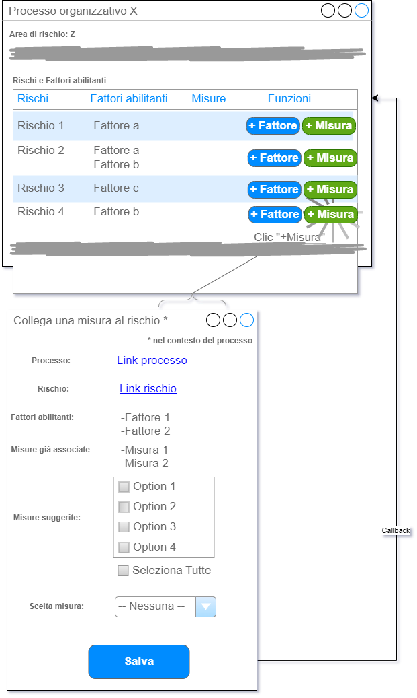

### IL PxI DEI RISCHI

Nella mappatura dei livelli di rischio effettuata fino alla versione 1.70 del software, il livello di rischio è stato sempre valutato in rapporto ai **processi** organizzativi; una rilevazione, cioè l’effettuazione di una serie di interviste rivolte a specifiche strutture che presiedono a specifici processi organizzativi, permette infatti di ottenere un giudizio sintetico di rischio per ogni processo organizzativo considerato.

I livelli di rischio ottenuti sono quindi declinati per processo, indipendentemente dalla numerosità e dal tipo dei rischi cui il processo stesso risulta associato. Fino a questo livello di evoluzione del software, pertanto, il calcolo dei livelli di rischio cui i processi sono esposti non dipende quindi dal rischio, ma solo dalle risposte ai quesiti e dai processi esaminati.

È evidente che, implicitamente, nel contesto di ciascun processo organizzativo i quesiti sono volti a investigare specifici aspetti rischiosi, che ci si aspetta di vedere esplicitati poi nell’elenco dei rischi corruttivi associati al processo stesso. Nel software, però, le relazioni tra **quesito e rischio** e tra **quesito e processo** sono considerate **ortogonali** tra loro, cioè non vengono messe in relazione in modo esplicito, e non vi sono regole di business che collegano i rischi di cui un quesito è implicitamente indicativo con i rischi che vengono associati, in modo separato, al processo.

Siccome, però, **la misura si applica al rischio**, bisogna in qualche modo ottenere i PxI dei rischi per poter stimare come questi si riducono a seguito dell’applicazione delle misure sui rischi stessi.

Il modo più semplice per ottenere i PxI dei singoli rischi, e anche più consistente con i ragionamenti fatti finora per ottenere i PxI dei processi, consiste nel considerare tutti i PxI dei singoli rischi, in partenza, cioè prima dell’applicazione delle misure di mitigazione, pari esattamente al PxI del processo nel cui contesto i rischi sono stati individuati.

Ciò certamente corrisponde all’operazione di ottenere una granularità fine a partire da una granularità più grossa, operazione opinabile in quanto fornisce l’apparenza di un grado di precisione elevato mentre in realtà si basa su un dato aggregato meno preciso in partenza.

Tuttavia, si può anche assumere che, siccome il PxI di ogni processo è stato calcolato in modo molto rigoroso (una serie di quesiti hanno prodotto i valori di una serie di indicatori che, a loro volta, hanno prodotto i valori di 2 dimensioni le quali, a loro volta, hanno prodotto il valore del PxI) un’assunzione legittima è considerare che, siccome il processo risulta esposto, nel suo insieme, ad un certo livello di rischio, possiamo assumere che anche tutti i rischi che sono stati individuati in dettaglio sul processo stesso presentano, *mediamente*, lo stesso livello.

Si potrebbero qui fare mille distinguo, però gli unici altri modi elementari e consistenti tramite cui ottenere un PxI del singolo rischio sul singolo processo paiono essere, nel contesto di questa analisi:

- la pesatura del quesito in funzione del rischio

- l’effettuazione dell’intervista rischio per rischio.

La prima soluzione, che è stata anche approfondita nella documentazione dettagliata (come “Soluzione non implementata”) è piuttosto macchinosa; la seconda, dal canto suo, è concettualmente più semplice ma avrebbe comportato un aumento enorme delle interviste (per ogni processo vi sono almeno 3-4 rischi connessi, ma a volte i rischi individuati sono molti di più) ed effettuare la mappatura in questo modo sarebbe in ultima analisi risultato impraticabile: non è concretamente possibile rivolgere 100-150 quesiti a una singola struttura dalle 4 alle 10-12 volte per ogni processo, considerato che spesso una stessa struttura è stata intervistata in merito all’erogazione di 2-3 processi in altrettante interviste; p-.es., nel caso di una struttura che eroga 3 servizi e non viene interrogata in merito ad ambiti specifici, anziché rivolgere 50x3 quesiti = 150 quesiti avremmo dovuto rivolgere 50x3xN. Rischi di ogni processo ~ 1000 quesiti.

L’assunzione che consiste nel considerare i PxI dei rischi associati a un processo come pari al PxI del processo stesso è una soluzione, tutto sommato, accettabile e, sostanzialmente, di buon senso: se è vero che le risposte date hanno permesso di individuare un determinato livello di rischio, è accettabile, in mancanza di dati di maggior dettaglio, assegnare a tutti i rischi del processo, *in partenza*, quello stesso livello di rischio.

D’altro canto, si deve considerare anche che la riduzione del livello di rischio su un processo, a seguito dell’applicazione di una misura, è a sua volta pur sempre una stima: tramite uno specifico algoritmo di mitigazione (o contenimento del rischio), che esamineremo tra poco, il software stima che il livello di uno specifico rischio su uno specifico processo, in presenza di una (o più) misure calmieratrici, si riduca di una certa quantità. Ma si tratta, appunto, di una stima, di un valore presunto, e l’unico modo di verificare se effettivamente le cose sono andate come previsto consiste... nel rifare l’intervista!

È quest’ultimo, in effetti, l’unico modo veramente scientifico di procedere: nei confronti di una struttura che presiede un processo rivolgo una serie di domande tramite le quali desumo il livello di rischio attuale; poi applico le misure; infine rivolgo le stesse domande alla stessa struttura, sullo stesso processo, per verificare se le risposte sono cambiate a seguito dell’applicazione delle misure. Quantunque tutti i valori di rischio ottenuti in base alle risposte, date in pasto agli algoritmi per determinare i valori dei vari indicatori, delle dimensioni di rischio e, infine, del PxI, siano a loro volta delle stime, almeno il metro di misura che applico, rifacendo l’intervista, è lo stesso, e ciò permette di effettuare dei veri confronti.

#### CONCLUSIONI

A questo punto, quindi, possiamo concludere che il reale monitoraggio della mitigazione del rischio corruttivo verrà effettuato solo attraverso una nuova rilevazione, ovvero la risomministrazione di tutte le interviste a tutte le strutture considerate.

Nel frattempo, la parte del software che gestisce le misure di mitigazione, ha lo scopo di:

1.  generare una serie di suggerimenti circa le misure da attuare;

2.  permettere di assegnare una misura su un rischio (entro il contesto di un processo);

3.  permettere di stimare, tramite l’algoritmo di mitigazione, quale sarà l’effetto di tali misure (assegnate al rischio) sul rischio stesso.

Di seguito vengono riportate alcune tabelle esemplificative delle riduzioni dei livelli di rischio, basate su scenari concreti. Nelle tabelle non vengono riportate anche le misure ma l’ultima colonna presenta valori ricalcolati proprio sulla base dell’applicazione di misure previste.

<table>
<colgroup>
<col style="width: 20%" />
<col style="width: 33%" />
<col style="width: 20%" />
<col style="width: 12%" />
<col style="width: 14%" />
</colgroup>
<thead>
<tr class="header">
<th colspan="5"><strong>Esempio 1</strong></th>
</tr>
</thead>
<tbody>
<tr class="odd">
<td><strong>PROCESSO</strong></td>
<td><strong>RISCHI</strong></td>
<td>
<strong>PxI</strong>

<strong>Processo</strong>
</td>
<td>
<strong>PxI</strong>

<strong>Rischi</strong>
</td>
<td>
<strong>PxI Rischi</strong> (dopo l’applicazione delle misure)

<strong>~STIMA~</strong>
</td>
</tr>
<tr class="even">
<td rowspan="6">Concorsi per PTA</td>
<td> Assenza di adeguata pubblicità della selezione</td>
<td rowspan="6">
<mark>ALTO</mark>

Il processo è altamente esposto a rischio corruttivo in quanto trattasi di un processo che coinvolge molteplici soggetti, interni ed esterni. Un eventuale fenomeno corruttivo avrebbe un elevato impatto sull'immagine dell'Ateneo.
</td>
<td>ALTO</td>
<td>ALTO</td>
</tr>
<tr class="odd">
<td> Assenza di controlli autodichiarazioni rese dai commissari o dai candidati</td>
<td>ALTO</td>
<td>MEDIO</td>
</tr>
<tr class="even">
<td> Conflitto di interesse tra candidati e commissari</td>
<td>ALTO</td>
<td>BASSO</td>
</tr>
<tr class="odd">
<td> Eccessiva discrezionalità nella scelta del vincitore</td>
<td>ALTO</td>
<td>MINIMO</td>
</tr>
<tr class="even">
<td> Irregolare composizione della commissione e mancato rispetto dell'art. 35 bis del D.Lgs. n. 165/2001</td>
<td>ALTO</td>
<td>ALTO</td>
</tr>
<tr class="odd">
<td> Nomina di soggetti privi delle competenze necessarie ad operare una corretta valutazione dei candidati</td>
<td>ALTO</td>
<td>ALTO</td>
</tr>
<tr class="even">
<td></td>
<td></td>
<td></td>
<td></td>
<td></td>
</tr>
<tr class="odd">
<td></td>
<td></td>
<td></td>
<td></td>
<td></td>
</tr>
<tr class="even">
<td></td>
<td></td>
<td></td>
<td></td>
<td></td>
</tr>
<tr class="odd">
<td colspan="5"><strong>Esempio 2</strong></td>
</tr>
<tr class="even">
<td><strong>PROCESSO</strong></td>
<td><strong>RISCHI</strong></td>
<td>
<strong>PxI</strong>

<strong>Processo</strong>
</td>
<td>
<strong>PxI</strong>

<strong>Rischi</strong>
</td>
<td>
<strong>PxI Rischi</strong> (dopo l’applicazione delle misure)

<strong>~STIMA~</strong>
</td>
</tr>
<tr class="odd">
<td rowspan="2">Mobilità in entrata</td>
<td> Assenza di adeguata pubblicità della selezione</td>
<td rowspan="2">
BASSO

Il processo è esposto ad un basso livello di rischio corruttivo in quanto trattasi di un processo che coinvolge pochi soggetti. Il processo è ben presidiato dagli uffici competenti.
</td>
<td>BASSO</td>
<td>MINIMO</td>
</tr>
<tr class="even">
<td> Assenza di criteri predeterminati nei bandi</td>
<td>BASSO</td>
<td>BASSO</td>
</tr>
<tr class="odd">
<td colspan="5"><strong>Esempio 3</strong></td>
</tr>
<tr class="even">
<td rowspan="6">Concessione agevolazioni e incentivi agli studenti</td>
<td> Assenza di adeguata pubblicità della selezione</td>
<td rowspan="6">
<mark>MEDIO</mark>

Il processo è mediamente esposto a rischio corruttivo in quanto trattasi di un processo che coinvolge molteplici soggetti, sia interni che esterni all'Ateneo. La presenza di segnalazioni da parte degli utenti aumenta l'esposizione al rischio.
</td>
<td>MEDIO</td>
<td>BASSO</td>
</tr>
<tr class="odd">
<td> Assenza di controlli sulle autodichiarazioni rese dai richiedenti</td>
<td>MEDIO</td>
<td>MEDIO</td>
</tr>
<tr class="even">
<td> Fruizione indebita di agevolazioni favorita dalla modifica frequente del piano di studi</td>
<td>MEDIO</td>
<td>BASSO</td>
</tr>
<tr class="odd">
<td> Inosservanza delle regole in materia di trasparenza</td>
<td>MEDIO</td>
<td>MINIMO</td>
</tr>
<tr class="even">
<td> Mancato recupero dei crediti</td>
<td>MEDIO</td>
<td>MEDIO</td>
</tr>
<tr class="odd">
<td> Riconoscimento indebito del contributo a soggetti non in possesso dei requisiti previsti dal bando</td>
<td>MEDIO</td>
<td>BASSO</td>
</tr>
</tbody>
</table>

Conclude questa parte di sviluppo l’implementazione del **monitoraggio delle misure**, che non bisogna confondere con il monitoraggio “multirilevazione” costituito dalla rieffettuazione delle interviste.

Il monitoraggio delle misure verrà affrontato più avanti in questa analisi e permetterà di capire se le strutture responsabili hanno effettivamente applicato le misure che era stato previsto di applicare nelle raccomandazioni e quindi se la riduzione stimata del livello di rischio ha trovato una effettiva realizzazione.

La tabella riportata sopra verrà quindi completata da una colonna di monitoraggio, che permette di controllare se le riduzioni desiderate sono state realizzate.

Di seguito viene riportata la stessa tabella mostrata sopra come Esempio 3 che presenta l’aggiunta di un ulteriore colonna, che conferma o smentisce la riduzione prevista, desiderata, richiesta e stimata.

I valori in parentesi (1 S, 1 G, 4 G etc.) sono composti da una parte numerica che rappresenta il numero di misure e una lettera che rappresenta il tipo delle misure.

P.es., 1 S = “1 misura Specifica”; 1 G = “1 misura Generica”; 4 G = “4 misure Generiche”.

Se questi valori tra parentesi sono nella colonna della STIMA allora si tratta di misure previste; i valori che si trovano nell’ultima colonna indicano le misure applicate.

P.es., in prima riga era previsto di applicare 1 misura Specifica ma ne sono state applicate zero.

<table>
<colgroup>
<col style="width: 17%" />
<col style="width: 29%" />
<col style="width: 16%" />
<col style="width: 10%" />
<col style="width: 12%" />
<col style="width: 14%" />
</colgroup>
<thead>
<tr class="header">
<th colspan="6"><strong>Esempio 3</strong></th>
</tr>
</thead>
<tbody>
<tr class="odd">
<td><strong>PROCESSO</strong></td>
<td><strong>RISCHI</strong></td>
<td>
<strong>PxI</strong>

<strong>Processo</strong>
</td>
<td>
<strong>PxI</strong>

<strong>Rischi</strong>
</td>
<td>
<strong>PxI Rischi</strong> (dopo l’applicazione delle misure)

<strong>~STIMA~</strong>
</td>
<td><strong>PxI Rischi</strong> (dopo l’effettuazione del monitoraggio delle misure)</td>
</tr>
<tr class="even">
<td rowspan="6">Concessione agevolazioni e incentivi agli studenti</td>
<td> Assenza di adeguata pubblicità della selezione</td>
<td rowspan="6">
<mark>MEDIO</mark>

Il processo è mediamente esposto a rischio corruttivo in quanto trattasi di un processo che coinvolge molteplici soggetti, sia interni che esterni all'Ateneo. La presenza di segnalazioni da parte degli utenti aumenta l'esposizione al rischio.
</td>
<td>MEDIO</td>
<td>BASSO (1S)</td>
<td>MEDIO (0)</td>
</tr>
<tr class="odd">
<td> Assenza di controlli sulle autodichiarazioni rese dai richiedenti</td>
<td>MEDIO</td>
<td>MEDIO (1G)</td>
<td>BASSO (1S)</td>
</tr>
<tr class="even">
<td> Fruizione indebita di agevolazioni favorita dalla modifica frequente del piano di studi</td>
<td>MEDIO</td>
<td>
BASSO

(1G + 1S)
</td>
<td>BASSO (1S)</td>
</tr>
<tr class="odd">
<td> Inosservanza delle regole in materia di trasparenza</td>
<td>MEDIO</td>
<td>MINIMO (4G)</td>
<td>BASSO (3G)</td>
</tr>
<tr class="even">
<td> Mancato recupero dei crediti</td>
<td>MEDIO</td>
<td>MEDIO (1G)</td>
<td>MEDIO (0)</td>
</tr>
<tr class="odd">
<td> Riconoscimento indebito del contributo a soggetti non in possesso dei requisiti previsti dal bando</td>
<td>MEDIO</td>
<td>BASSO (1S)</td>
<td>MEDIA (1G)</td>
</tr>
</tbody>
</table>

A questo proposito,

- Se la struttura ha disatteso l’applicazione di tutte o di parte delle misure, il livello del PxI sarà, **rispettivamente**, simile oppure identico a quello che precedeva l’assegnazione delle misure (quindi si ritorna al livello di partenza);

- se invece la struttura ha effettivamente applicato tutte le misure previste, i valori coincideranno con quelli stimati.

Nella tabella sopra in parentesi viene riportato il numero di misure previste e, nell’ultima colonna, il numero di misure che, a seguito del monitoraggio, risultano essere state effettivamente applicate.

A questo punto la domanda diventa: come si fa, concretamente, a stimare la riduzione del rischio in funzione dell’applicazione della misura? Cioè, come faccio a quantificare di *quanto* si è ridotto il rischio in base alle misure applicate? Per fare questo, serve **un algoritmo di mitigazione**.

### ALGORITMI DI MITIGAZIONE E RICALCOLO

Abbiamo visto che, avendo a disposizione il PxI di un dato processo, calcolato in base alle risposte e ai valori degli indicatori connessi, è possibile assumere che tutti i rischi di quel dato processo abbiano, mediamente, quel medesimo PxI. Assegnando una o più misure calmieranti a un rischio, possiamo stimare che il PxI di quel rischio diminuirà. Il problema, a questo punto, è stabilire *quanto* il PxI del rischio diminuirà a seguito dell’applicazione delle misure stesse, e *se* questa diminuzione dipende da alcune caratteristiche intrinseche (cioè alcuni specifici attributi) della misura stessa.

#### OBIETTIVO

Deve quindi essere elaborato un algoritmo che sottrae ad ogni PxI del rischio una certa quantità a seguito dell’applicazione della misura. Definiamo questo un **algoritmo di mitigazione**.

Tale algoritmo può avere un grado di complessità variabile:

- a un estremo vi è uno scenario di implementazione estremamente semplificato;  
  p.es.: *Abbassamento di “un livello” di rischio se c’è la misura;* quindi: assunto che il PxI iniziale era ALTO; se c’è una misura passo da ALTO → MEDIO; se ce ne sono due passo da MEDIO → BASSO etc.

- all’altro estremo vi è uno scenario di implementazione estremamente complesso;  
  p.es.: *Riduzione di un valore variabile tra 0 e 1 e dipendente dalla tipologia della misura, dal carattere della misura stessa, dalla presenza della struttura capofila della misura tra le strutture che contribuiscono alle fasi del processo,* etc.

Su questo continuum bisogna scegliere una soluzione che permetta di rappresentare la complessità insita negli scenari reali pur senza complicare in modo eccessivo i calcoli.

La granularità di azione dell’algoritmo è piuttosto fine. L’effetto di mitigazione deve infatti essere determinato sul singolo rischio, ovvero bisogna stabilire che, dato un PxI di un rischio, e considerato un insieme di misure assegnate sul rischio stesso, il PxI del rischio venga ritoccato, tramite l’algoritmo di mitigazione, quindi ricalcolato per ogni PxI di ogni rischio piuttosto che direttamente sul PxI complessivo del processo (ricordiamo che il PxI di un processo viene “spalmato” su tutti i rischi assegnati al processo stesso).

Nulla vieta, successivamente, di applicare un algoritmo a tutti i PxI di tutti i rischi cui un processo è esposto, ottenendo un unico PxI dei rischi del processo. Definiamo questo un **algoritmo di ricalcolo**.

Solo una volta calcolati – tramite l’algoritmo di **mitigazione** – tutti i PxI dei singoli rischi mitigati, potrà quindi essere applicato questo ulteriore algoritmo, “verticale” – l’algoritmo di **ricalcolo** – che permette di ricalcolare il PxI dell’intero processo a seguito dell’applicazione delle misure.

È su questo valore ricalcolato che si dovrebbe vedere l’effetto apportato dalle misure di mitigazione, nel senso che il PxI di un dato processo con rischi privi di misure (cioè il PxI ottenuto originariamente a seguito dell’intervista) dovrebbe essere maggiore, o al più uguale, al PxI dello stesso processo calmierato tramite le misure di mitigazione applicate ai suoi rischi.

Oltre ad un algoritmo di contenimento, o mitigazione, o riduzione del rischio, deve quindi essere elaborato un algoritmo di ricalcolo del PxI complessivo del processo, a partire dai PxI dei singoli rischi, calmierati tramite le misure.

#### L’ALGORITMO DI CONTENIMENTO (O MITIGAZIONE) DEL RISCHIO

L’algoritmo di contenimento (o mitigazione, o riduzione...) del rischio corruttivo permette di ottenere un valore del PxI di uno specifico rischio ridotto in funzione dell’applicazione di una o più misure di mitigazione.

Per determinare questo algoritmo, si procede nel seguente modo:

1.  si quantificano, tramite una funzione di codifica, i valori del PxI del rischio facendo corrispondere ad ogni valore un numero intero, variabile da 0 per il rischio MINIMO a 4 per il rischio MOLTO ALTO;

2.  \- per ogni misura di carattere generale si sottrae 0.5 dal valore del PxI del rischio;  
    - per ogni misura di carattere specifico si sottrae 1.0 dal valore del PxI del rischio

3.  nei calcoli vengono effettuati solo arrotondamenti per eccesso; quindi per considerare un PxI ridotto di un livello bisogna che le misure abbiano determinato almeno una riduzione di 1 (da 1.0 a 1.9).

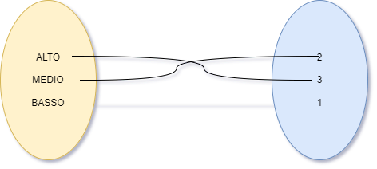

I valori assegnati ai livelli dei PxI possono essere ricavati dalla seguente tabella:

| **PxI su scala ordinale** | **PxI su scala a intervalli** |
|---------------------------|-------------------------------|
| MINIMO                    | 0                             |
| BASSO                     | 1                             |
| MEDIO                     | 2                             |
| ALTO                      | 3                             |
| MASSIMO                   | 4                             |

**NOTA BENE**

Da un punto di vista statistico, l’operazione di trasformare valori chiaramente su scala ordinale in valori su scala a intervalli uguali (anzi, su scala di rapporti, perché è stato determinato uno zero in modo univoco) è sicuramente un abuso di notazione, perché fornisce un’impressione di precisione che nei dati non esiste; ad esempio, sicuramente un PxI MOLTO ALTO (o Massimo) sarà maggiore di un PxI medio, ma non si può dire che MOLTO ALTO sia esattamente il doppio di MEDIO, cosa che invece la trasformazione numerica dà l’impressione di poter concludere (perché 4 è il doppio di 2). Analogamente, neppure si può dire che un PxI ALTO valga esattamente come 3 PxI BASSI.

Pertanto, a prescindere da qualunque conversione arbitraria, bisogna considerare che i dati relativi ai PxI (livelli di rischio) sono e resteranno sempre misurati su scala ordinale, non su scala a intervalli o di rapporti.

D’altro canto, la conversione numerica permette di determinare i livelli di mitigazione in maniera molto più pratica rispetto a una “mitigazione ordinale”. L’importante è ricordarsi che l’apparente precisione non corrisponde ad una precisione effettiva nei dati.

Per fare un esempio, riprendiamo la tabella precedente:

<table>
<colgroup>
<col style="width: 30%" />
<col style="width: 17%" />
<col style="width: 12%" />
<col style="width: 13%" />
<col style="width: 13%" />
<col style="width: 13%" />
</colgroup>
<thead>
<tr class="header">
<th colspan="6"><strong>Concessione agevolazioni e incentivi agli studenti</strong></th>
</tr>
</thead>
<tbody>
<tr class="odd">
<td>
<strong>RISCHI</strong>

<strong>(a)</strong>
</td>
<td>
<strong>PxI</strong>

<strong>Processo</strong>

<strong>(b)</strong>
</td>
<td>
<strong>PxI</strong>

<strong>Rischi</strong>

<strong>(c)</strong>
</td>
<td>
<strong>PxI Rischi (d)</strong> (dopo l’applicazione delle misure)

<strong>~STIMA~</strong>
</td>
<td><strong>PxI Rischi (e)</strong> (dopo aver effettuato il <strong>monitoraggio</strong> delle misure)</td>
<td><strong>PxI Processo (f)</strong> (dopo applicazione misure <strong>E</strong> monitoraggio)</td>
</tr>
<tr class="even">
<td> Assenza di adeguata pubblicità della selezione</td>
<td rowspan="6">
<mark>MEDIO</mark>

Il processo è mediamente esposto a rischio corruttivo in quanto trattasi di un processo che coinvolge molteplici soggetti, sia interni che esterni all'Ateneo. La presenza di segnalazioni da parte degli utenti aumenta l'esposizione al rischio.
</td>
<td>MEDIO</td>
<td>BASSO {1S}</td>
<td>MEDIO (0)</td>
<td rowspan="6"><mark>MEDIO</mark></td>
</tr>
<tr class="odd">
<td> Assenza di controlli sulle autodichiarazioni rese dai richiedenti</td>
<td>MEDIO</td>
<td>MEDIO {1G}</td>
<td>BASSO (1S)</td>
</tr>
<tr class="even">
<td> Agevolazioni indebite favorite dalla modifica frequente del piano di studi</td>
<td>MEDIO</td>
<td>
BASSO

{1G + 1S}
</td>
<td>BASSO (1S)</td>
</tr>
<tr class="odd">
<td> Inosservanza delle regole in materia di trasparenza</td>
<td>MEDIO</td>
<td>MINIMO {4G}</td>
<td>BASSO (3G)</td>
</tr>
<tr class="even">
<td> Mancato recupero dei crediti</td>
<td>MEDIO</td>
<td>MEDIO {1G}</td>
<td>MEDIO (0)</td>
</tr>
<tr class="odd">
<td> Riconoscimento indebito del contributo a soggetti non in possesso dei requisiti previsti dal bando</td>
<td>MEDIO</td>
<td>BASSO {1S}</td>
<td>MEDIA (1G)</td>
</tr>
</tbody>
</table>

Come leggiamo questa tabella?

Colonna **b** : Anzitutto, le interviste hanno permesso di determinare un rischio MEDIO per questo processo

Colonna **c** : Prima dell’applicazione delle misure, quindi, il valore di rischio di ogni rischio del processo è stato assegnato a MEDIO

Colonna **d** : Sulla base delle informazioni a sua disposizione, e dei dati raccolti contestualmente alle interviste, l’esperto di valutazione del rischio corruttivo ha stimato che:

- al RISCHIO 1 dovessero essere applicate: 1 misura specifica ({1 S} vale -1)

- al RISCHIO 2 dovessero essere applicate: 1 misura generica ({1 G} vale -0.5)

- al RISCHIO 3 dovessero essere applicate: 2 misure: 1 specifica e 1 generica ({1G + 1S} valgono -1.5)

- al RISCHIO 4 dovessero essere applicate 4 misure generiche ({4G} valgono 4x-0.5 = -2)

- al RISCHIO 5 dovessero essere applicate 1 misura generica ({1G} vale -0.5)

- al RISCHIO 6 dovessero essere applicate 1 misura specifica ( {1S} vale -1)

Conseguentemente, i livelli di PxI dei rischi si sarebbero dovuti ridurre come segue:

- RISCHIO 1: 2 (cioè MEDIO) – 1.0 = 1 = BASSO

- RISCHIO 2: 2 – 0.5 = 1.5 → pari a 2 = MEDIO

- RISCHIO 3: 2 – 1.5 = 0.5 → pari a 1 = BASSO

- RISCHIO 4: 2 – 2 = 0 → pari a 0 = MINIMO

- RISCHIO 5: 2 – 0.5 = 1.5 → pari a 2 = MEDIO

- RISCHIO 6: 2 – 1 = 1 → pari a 1 = BASSO

Colonna **e** : A seguito dell’effettuazione del monitoraggio, l’esperto ha trovato la seguente situazione:

- RISCHIO 1: nessuna misura applicata → 2 – 0 = 2 = MEDIO

- RISCHIO 2: una misura specifica applicata → 2 – 1 = 1 = BASSO

- RISCHIO 3: una misura specifica applicata → 2 – 1 = 1 = BASSO

- RISCHIO 4: 3 misure generiche applicate → 2 – 1.5 = 0.5 → pari a 1 = BASSO

- RISCHIO 5: nessuna misura applicata → 2 – 0 = 2 = MEDIO

- RISCHIO 6: una misura generica applicata → 2 – 0.5 = 1.5 → pari a 2 = MEDIO

Si può concludere che, nella maggior parte dei casi, la situazione monitorata è risultata peggiore di quella prevista. Solo rispetto al RISCHIO 2, siccome la struttura è riuscita ad introdurre una misura specifica piuttosto che quella generica raccomandata, la situazione è risultata migliore dopo il monitoraggio (anche se sarà da valutare se l’arbitrio della struttura nel cambiare la misura è stato giustificato). Nel caso del rischio 3, la situazione è risultata essere uguale a quella prevista negli effetti però peggiore nella modalità perché l’applicazione di una misura specifica, avendo tolto 1, è stata sufficiente per ridurre il PxI da MEDIO a BASSO, come era stato richiesto e stimato prima del monitoraggio; ciò nonostante, era previsto che venissero applicate 2 misure: una generica + una specifica, per cui la struttura, pur avendo ottenuto una riduzione effettiva del PxI sul rischio, è risultata comunque parzialmente inadempiente rispetto alle aspettative.

Insomma, esiste anche una valutazione qualitativa da considerare, oltre a quella della dimensione puramente quantitativa dovuta alle misure applicate.

**NOTA BENE**

Una delle ipotesi che erano state considerate, nel valutare come dovesse essere calcolato l’apporto di mitigazione delle misure, era di applicare un algoritmo che seguisse una scala logaritmica

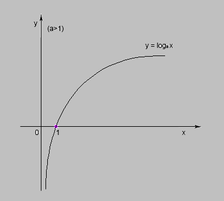

dove funzione logaritmica *f(x) = loga(x)* è una funzione definita in **ℝ** e con a\>0, a≠1 (qui a\>1).

Ciò avrebbe significato che l’apporto mitigante di ogni misura sarebbe stato via via minore quanto più venivano aggiunte misure. Per esempio, la prima misura specifica vale -1, la seconda vale -0.95, la terza vale -0.92 e così via; analogamente la prima misura generica vale -0.5, la seconda vale -0.48, la terza -0.45 etc. In questo modo, dopo una certa soglia, aggiungere ulteriori misure non avrebbe avuto senso perché quelle aggiunte non avrebbero sortito un effetto significativo. Il criterio generale sarebbe stato valido anche per serie alternate di misure generiche e specifiche.

Tuttavia, la decisione di smussare l’effetto delle misure man mano che vengono applicate dopo altre misure è risultata troppo arbitraria, oltre che macchinosa; inoltre, non è detto che misure applicate dopo altre misure debbano avere un effetto ridotto, perché potrebbe anche essere vero il contrario: magari applicare una misura dopo che un’altra ha già “lavorato” su alcuni aspetti è più efficace, non meno.

Per questi motivi, l’effetto mitigante delle misure è stato alla fine considerato come lineare, non logaritmico.

Colonna **f** : Nonostante le riduzioni dei PxI dei rischi ottenute, i valori ottenuti non sono sufficienti, dopo il monitoraggio, per sancire che ci sia stata una riduzione del PxI complessivo del processo, da MEDIO a BASSO.

Quest’ultima conclusione dipende dall’applicazione di uno specifico algoritmo di ricalcolo.

#### L’ALGORITMO DI RICALCOLO

Il valore complessivo del PxI del processo a seguito dell’applicazione e del monitoraggio delle misure può essere determinato calcolando *la media* dei valori finali, certificati dal monitoraggio stesso.

Certo, torna qui il problema della scala di misura. Essendo i valori originari su scala ordinale e non su scala a intervalli, la media non potrebbe essere a rigore calcolata, ma dovrebbe essere utilizzata, al più, la mediana. Tuttavia, persistendo nella forzatura, si può provare ad ottenere un algoritmo basato sulla media aritmetica dei valori convertiti.

Nel caso preso in esame, la situazione **stimata** era la seguente:

<table>
<colgroup>
<col style="width: 12%" />
<col style="width: 12%" />
<col style="width: 13%" />
<col style="width: 14%" />
<col style="width: 15%" />
<col style="width: 18%" />
<col style="width: 13%" />
</colgroup>
<thead>
<tr class="header">
<th><strong>PxI del Processo</strong></th>
<th>
<strong>Valori ricavati dal</strong>

<strong>PxI del Processo (c)</strong>
</th>
<th>
Misure richieste

<strong>(d)</strong>

<strong>~STIMA~</strong>
</th>
<th>
<strong>Quantifica-zione (d1)</strong>

<strong>~STIMA~</strong>
</th>
<th>
<strong>Valori calmierati (d2)</strong> (non arrotondati)

<strong>~STIMA~</strong>
</th>
<th>
<strong>Valori calmierati (d3)</strong> (arrotondati per eccesso)

<strong>~STIMA~</strong>
</th>
<th><strong>PxI ricalcolato (d4)</strong> a seguito dell’ applicazione delle misure <strong>~STIMA~</strong></th>
</tr>
</thead>
<tbody>
<tr class="odd">
<td rowspan="6">MEDIO</td>
<td>MEDIO (2)</td>
<td>{1S}</td>
<td>-1</td>
<td>1</td>
<td>BASSO</td>
<td rowspan="6">BASSO</td>
</tr>
<tr class="even">
<td>MEDIO (2)</td>
<td>{1G}</td>
<td>-0.5</td>
<td>1.5</td>
<td>MEDIO</td>
</tr>
<tr class="odd">
<td>MEDIO (2)</td>
<td>{1G + 1S}</td>
<td>-1.5</td>
<td>0.5</td>
<td>BASSO</td>
</tr>
<tr class="even">
<td>MEDIO (2)</td>
<td>{4G}</td>
<td>-2</td>
<td>0</td>
<td>MINIMO</td>
</tr>
<tr class="odd">
<td>MEDIO (2)</td>
<td>{1G}</td>
<td>-0.5</td>
<td>1.5</td>
<td>MEDIO</td>
</tr>
<tr class="even">
<td>MEDIO (2)</td>
<td>{1S}</td>
<td>-1</td>
<td>1</td>
<td>BASSO</td>
</tr>
</tbody>
</table>

Se per effettuare la media ci basassimo sui valori già arrotondati per eccesso (colonna d3) perderemmo l’apporto delle misure che sono state applicate ma che non sono riuscite ad ottenere una variazione di almeno 1 (nell’analisi di dettaglio sono riportate varie SOLUZIONI prese in esame ma poi scartate, a questo proposito).

Siccome, però, vogliamo considerare solo l’effetto delle misure che effettivamente hanno prodotto una riduzione del livello di rischio, nel ricalcolo di un PxI generale del processo, effettuiamo tale ricalcolo sui valori calmierati **arrotondati** (colonna d3).

Pertanto, si ha:

Il valore ottenuto x è \< 2 e \> 1 (cioè è compreso tra uno e due: 1 \< x \< 2) ma, seguendo le normali regole di arrotondamento *(arrotondamento per eccesso se la cifra decimale è superiore a 5, per difetto se è inferiore a 5, per eccesso se la cifra decimale è 5 e la cifra che la precede è dispari etc.),* va arrotondato, per difetto, al primo valore intero successivo, in questo caso 1, quindi il PxI ricalcolato è pari a BASSO, in questo esempio.

Tutta questa situazione viene riassunta dalla tabella presentata di seguito, che corrisponde alla tabella precedente a cui sono state aggiunte altre 4 colonne, che presentano in dettaglio la situazione che si è riscontrata a seguito del monitoraggio. Il significato delle colonne aggiunte è lo stesso delle colonne corrispondenti nelle stime, con la differenza che i dati sono differenti, in questo caso specifico (ma potrebbe anche verificarsi il caso in cui il monitoraggio riscontra che l’applicazione delle misure abbia effettivamente ricalcato quanto stimato in precedenza).

<table>
<colgroup>
<col style="width: 7%" />
<col style="width: 7%" />
<col style="width: 8%" />
<col style="width: 9%" />
<col style="width: 9%" />
<col style="width: 8%" />
<col style="width: 11%" />
<col style="width: 9%" />
<col style="width: 8%" />
<col style="width: 8%" />
<col style="width: 8%" />
</colgroup>
<thead>
<tr class="header">
<th><strong>PxI del Processo</strong></th>
<th>
<strong>Valori ricavati dal</strong>

<strong>PxI del Processo (c)</strong>
</th>
<th>
Misure richieste

<strong>(d)</strong>

<strong>~STIMA~</strong>
</th>
<th>
<strong>Quantificazione misure (d1)</strong>

<strong>~STIMA~</strong>
</th>
<th>
<strong>Valori calmierati (d2)</strong> (non arrotondati)

<strong>~STIMA~</strong>
</th>
<th>
<strong>Valori calmierati (d3)</strong> (arrotondati per eccesso)

<strong>~STIMA~</strong>
</th>
<th><strong>PxI ricalcolato (d4)</strong> a seguito dell’ applicazione delle misure <strong>~STIMA~</strong></th>
<th><strong>Misure effettivamente applicate</strong> ~MONITO-RAGGIO~</th>
<th>
<strong>Quantificazione misure (d5)</strong>

<strong>~MONITORAGGIO~</strong>
</th>
<th>
<strong>Valori calmierati (d6)</strong> (non arrotondati)

<strong>~MONITORAGGIO~</strong>
</th>
<th><strong>PxI ricalcolato</strong> ~MONITORAGGIO~</th>
</tr>
</thead>
<tbody>
<tr class="odd">
<td rowspan="6">MEDIO</td>
<td>MEDIO (2)</td>
<td>{1S}</td>
<td>-1</td>
<td>1</td>
<td>BASSO</td>
<td rowspan="6">BASSO</td>
<td>(-)</td>
<td>0</td>
<td>2</td>
<td rowspan="6">MEDIO</td>
</tr>
<tr class="even">
<td>MEDIO (2)</td>
<td>{1G}</td>
<td>-0.5</td>
<td>1.5</td>
<td>MEDIO</td>
<td>(1S)</td>
<td>-1</td>
<td>1</td>
</tr>
<tr class="odd">
<td>MEDIO (2)</td>
<td>{1G + 1S}</td>
<td>-1.5</td>
<td>0.5</td>
<td>BASSO</td>
<td>(1S)</td>
<td>-1</td>
<td>1</td>
</tr>
<tr class="even">
<td>MEDIO (2)</td>
<td>{4G}</td>
<td>-2</td>
<td>0</td>
<td>MINIMO</td>
<td>(3G)</td>
<td>-1.5</td>
<td>0.5</td>
</tr>
<tr class="odd">
<td>MEDIO (2)</td>
<td>{1G}</td>
<td>-0.5</td>
<td>1.5</td>
<td>MEDIO</td>
<td>(-)</td>
<td>0</td>
<td>2</td>
</tr>
<tr class="even">
<td>MEDIO (2)</td>
<td>{1S}</td>
<td>-1</td>
<td>1</td>
<td>BASSO</td>
<td>(1G)</td>
<td>-0.5</td>
<td>1.5</td>
</tr>
</tbody>
</table>

### VISTA DELL’IMPLEMENTAZIONE

Oltre all’implementazione delle viste: 1. registro delle misure e 2. funzione di associazione tra misura, rischio e processo, si prevede di implementare due nuove interfacce, 3. e 4., per visualizzare la mitigazione del rischio corruttivo in base alle previste misure di prevenzione:

3.  il PxI dei rischi e delle misure

4.  la tabella delle misure

Inoltre, si prevede di modificare un’interfaccia esistente (tabella dei rischi) aggiungendo una nuova colonna:

5.  la mitigazione del rischio stimata in funzione delle misure di prevenzione previste

#### 3. REPORT PxI DEI RISCHI (E DELLE MISURE)

Il report PxI basato sui processi, rilasciato nel software dalla versione 1.50, prevede la generazione di una tabella a doppia entrata, avente in riga i processi ed in colonna gli indicatori di rischio. La confluenza tra il processo (riga) e l’indicatore (colonna) identifica la cella con il valore di rischio cercato. Questo report è chiamato semplicemente “Report PxI” (o “Report probabilità x impatto”):

Si prevede di implementare una nuova tabella a doppia entrata, recante in riga i rischi contestuali ai processi ed in colonna i valori del PxI stimati in funzione della mitigazione prevista. Lo schema del report è riportato nella tabella seguente:

<table>
<colgroup>
<col style="width: 12%" />
<col style="width: 10%" />
<col style="width: 11%" />
<col style="width: 9%" />
<col style="width: 12%" />
<col style="width: 10%" />
<col style="width: 10%" />
<col style="width: 10%" />
<col style="width: 10%" />
</colgroup>
<thead>
<tr class="header">
<th></th>
<th>
<strong>PxI</strong>

processo
</th>
<th>
<strong>PxI</strong>

“spalmato” (distribuito)
</th>
<th><strong>Misure previste</strong></th>
<th>Mitigazione stimata</th>
<th><strong>PxI</strong> mitigato (~stima~)</th>
<th><strong>Misure applicate</strong> (monitoraggio)</th>
<th>Mitigazione effettiva</th>
<th><strong>PxI</strong> (monito-raggio)</th>
</tr>
</thead>
<tbody>
<tr class="odd">
<td>PROCESSO 1</td>
<td rowspan="4">ALTO</td>
<td></td>
<td></td>
<td></td>
<td rowspan="4">MEDIO</td>
<td></td>
<td></td>
<td rowspan="4">ALTO</td>
</tr>
<tr class="even">
<td>Rischio 1</td>
<td>ALTO</td>
<td>2G</td>
<td>MEDIO</td>
<td>SI + SI</td>
<td>MEDIO</td>
</tr>
<tr class="odd">
<td>Rischio 2</td>
<td>ALTO</td>
<td>1S</td>
<td>MEDIO</td>
<td>NO</td>
<td>ALTO</td>
</tr>
<tr class="even">
<td>Rischio 3</td>
<td>ALTO</td>
<td>1G + 1S</td>
<td>MEDIO</td>
<td>SI + NO</td>
<td>ALTO</td>
</tr>
<tr class="odd">
<td>PROCESSO 2</td>
<td rowspan="3">MEDIO</td>
<td></td>
<td></td>
<td></td>
<td rowspan="3">BASSO</td>
<td></td>
<td></td>
<td rowspan="3">BASSO</td>
</tr>
<tr class="even">
<td>Rischio 4</td>
<td>MEDIO</td>
<td>3G</td>
<td>BASSO</td>
<td>NO+SI+SI</td>
<td>BASSO</td>
</tr>
<tr class="odd">
<td>Rischio 5</td>
<td>MEDIO</td>
<td>1G + 1S</td>
<td>BASSO</td>
<td>NO + SI</td>
<td>BASSO</td>
</tr>
<tr class="even">
<td>...</td>
<td>(a)</td>
<td>(b)</td>
<td>(c)</td>
<td>(d)</td>
<td>(e)</td>
<td>(f)</td>
<td>(g)</td>
<td>(h)</td>
</tr>
<tr class="odd">
<td colspan="6">← REGISTRO ← |</td>
<td colspan="3">→ MONITORAGGIO →</td>
</tr>
</tbody>
</table>

La prima colonna (non etichettata), al posto dei macroprocessi e processi del Report PxI, elenca rispettivamente i processi e i loro rischi.

Ogni processo ha già un valore calcolato del PxI (colonna **a**).

Questo, effettuando un’assunzione legittima, viene assegnato ad ogni rischio; in altre parole, dal momento che il PxI complessivo del processo è TOT, si assume che ogni rischio del processo stesso sia pari a TOT; non si determina cioè un PxI specifico di ogni rischio, ma inizialmente si parte dal PxI generale, assumendo, in modo leggermente forzato ma comunque logicamente sensato, che il valore PxI di ogni rischio specifico sia pari al PxI generale. Questo valore viene chiamato, nella tabella, **“PxI spalmato” (o distribuito)**. La regola è quindi che ogni valore del PxI distribuito dev’essere uguale al PxI generale del processo.

Successivamente, si ricavano le misure assegnate sul rischio nel contesto del processo. Nell’esempio, è stato previsto di assegnare 2 misure generiche sul Rischio 1, 1 misura specifica sul Rischio 2 e 1 misura generica e 1 specifica sul Rischio 3 (colonna **“Misure previste”**, o colonna **c**).

Sulla base degli algoritmi già definiti nei paragrafi precedenti, queste misure comportano una riduzione del rischio, pari a 0,5 per ogni misura generica e pari a 1 per ogni misura specifica. Ciò si concretizza in una riduzione prevista del rischio (chiamata **“Mitigazione stimata”**) dipendente dalla quantità e dal tipo delle misure stesse (colonna **d**).

A partire dai valori di mitigazione stimata di ogni rischio, si ricalcola un **PxI mitigato (stimato)** tramite un algoritmo di ricalcolo (v. relativo paragrafo).

Tutte queste colonne (**a – e**) sono relative alla parte di registrazione delle misure e assegnazione ai relativi rischi e processi.

A seguire, nel report, possono essere previste colonne di monitoraggio (colonne **f – h**).

In particolare, per ogni misura prevista, il monitoraggio risponde alla domanda: la misura prevista è stata applicata? Per ognuna di queste domande possono esservi 3 valori: vero, falso, indecidibile. Il terzo valore (indecidibile, o non determinabile) significa che non è stato possibile determinare se la misura sia stata applicata o meno, in quanto mancano alcune informazioni essenziali per la determinazione della risposta. Laddove le informazioni siano sufficienti, però, la risposta dev’essere: VERO, cioè la misura è stata applicata; oppure FALSO, cioè la misura non è stata applicata. Si valuterà in seguito come trattare eventuali applicazioni parziali della misura (Misura parzialmente applicata).

La parte di monitoraggio, comunque, richiederà una sezione di analisi specifica, per cui al momento si rimanda a questo sviluppo ulteriore l’analisi dettagliata dei singoli casi.

#### 4. TABELLA DELLE MISURE

1.  Per poter agevolmente consultare, attraverso una visualizzazione generale e al contempo sufficientemente analitica (ovvero avente una granularità non abbastanza fine da poter risalire alla singola misura e al singolo rischio al quale la misura stessa è stata applicata) si può partire da una visualizzazione che ricalca quella del “report strutture e rischi” (anche detto “tabella delle strutture”):

Il contenuto delle colonne sarebbe modificato come segue:

<table style="width:100%;">
<colgroup>
<col style="width: 15%" />
<col style="width: 14%" />
<col style="width: 20%" />
<col style="width: 15%" />
<col style="width: 14%" />
<col style="width: 18%" />
</colgroup>
<thead>
<tr class="header">
<th><strong>Macroprocesso</strong></th>
<th><strong>Processo</strong></th>
<th><strong>Rischi</strong></th>
<th><strong>Misure</strong></th>
<th><strong>PxI Stima</strong></th>
<th><strong>PxI Monitoraggio</strong></th>
</tr>
</thead>
<tbody>
<tr class="odd">
<td>SUPPORTO PER LE ATTIVITA’ DI RICERCA</td>
<td>Accesso al Dottorato (BASSO)</td>
<td><ul>
<li>
Assenza di adeguata pubblicità della selezione
</li>
<li>
Conflitto di interesse tra candidati e commissari
</li>
<li>
Eccessiva discrezionalità nella scelta del vincitore
</li>
<li>
Inosservanza delle regole procedurali a garanzia della trasparenza e dell’imparzialità della selezione
</li>
<li>
Irregolare composizione della commissione e mancato rispetto dell’art. 35 bis del D.Lgs. n. 165/2001
</li>
<li>
Previsioni di requisiti di accesso “personalizzati” (cd Bandi fotografia)
</li>
</ul></td>
<td><ul>
<li>
Misura 1
</li>
<li>
Misura 2
</li>
<li>
Misura 4
</li>
<li>
Misura 23
</li>
</ul></td>
<td>BASSO</td>
<td>BASSO</td>
</tr>
<tr class="even">
<td>AFFIDAMENTO DI LAVORI, SERVIZI E FORNITURE SOTTOSOGLIA</td>
<td>
Affidamento e stipula del contratto

(MEDIO)
</td>
<td><ul>
<li>
Assenza di rotazione degli operatori economici consultati o chiamati
</li>
<li>
Verifica incompleta o non sufficientemente approfondita al fine di favorire un aggiudicatario privo dei requisiti richiesti dalla legge e dal bando
</li>
</ul></td>
<td><ul>
<li>
Misura 6
</li>
<li>
Misura 12
</li>
<li>
Misura 14
</li>
</ul></td>
<td>BASSO</td>
<td>MEDIO</td>
</tr>
<tr class="odd">
<td>AFFIDAMENTO DI LAVORI, SERVIZI E FORNITURE SOPRASOGLIA</td>
<td>
Aggiudicazione e stipula del contratto

(MEDIO)
</td>
<td><ul>
<li>
Annullamento di procedure di gara al fine di evitare l’aggiudicazione ad un determinato operatore
</li>
<li>
Limitazione delle possibilità di controllo da parte degli operatori o della collettività per carenza di informazioni pubbliche
</li>
<li>
Verifica incompleta o non sufficientemente approfondita al fine di favorire un aggiudicatario privo dei requisiti richiesti dalla legge e dal bando
</li>
</ul></td>
<td><ul>
<li>
Misura 8
</li>
<li>
Misura 12
</li>
<li>
Misura 14
</li>
<li>
Misura 28
</li>
</ul></td>
<td>BASSO</td>
<td>BASSO</td>
</tr>
<tr class="even">
<td></td>
<td></td>
<td></td>
<td></td>
<td></td>
<td></td>
</tr>
<tr class="odd">
<td>a</td>
<td>b</td>
<td>c</td>
<td>d</td>
<td>e</td>
<td>f</td>
</tr>
</tbody>
</table>

Come si vede, vengono aggiunte le colonne da cui si evince come cambia il PxI del processo nelle intenzioni dell’anticorruzione (colonna e) e nel riscontro del monitoraggio (colonna f).

## IL MONITORAGGIO

## 

Finora si è parlato estesamente della stima della mitigazione, ovvero degli effetti di mitigazione legati alle misure, calcolati in base alle misure previste (cioè che si stima verranno applicate).

Già sta emergendo però, in più punti, nelle viste mostrate e nei ragionamenti di analisi, la presenza di una o più colonne dedicate alle indicazioni dei valori del PxI rilevati a seguito della fase di monitoraggio.

In parole povere, la differenza tra stima e monitoraggio della mitigazione è la seguente:

- la stima della mitigazione è il valore del PxI che si otterrebbe se le misure previste fossero applicate;

- il monitoraggio della mitigazione è il valore del PxI che risulta ottenuto a seguito dell’applicazione delle misure che effettivamente sono risultate applicate.

Approfondiamo quindi ora il significato e l’ingegnerizzazione di questa fase ulteriore gestita dal software, ovvero la fase di monitoraggio delle misure.

### I NUOVI ATTORI

Le entità che caratterizzano questa fase di monitoraggio, atta a individuare quali delle misure richieste sono state effettivamente applicate, sono, oltre al già accennato indicatore di monitoraggio:

#### la fase di attuazione

#### la misurazione

### L’INDICATORE DI MONITORAGGIO

L’indicatore di monitoraggio permette di quantificare la natura e la quantità di interventi necessari per raggiungere un determinato obiettivo, il quale a sua volta risulta indicativo dell’applicazione della misura.

Gli indicatori di monitoraggio sono oggetti attinenti alla fase di **monitoraggio** del rischio.

Il software \[ROL\], fino a circa la versione 2.0 (vale a dire nei primi circa 100 deploy del software), è stato focalizzato:

1.  sulla **mappatura** dei rischi, ovvero sulla raccolta di dati, poi elaborati tramite specifici algoritmi, che hanno permesso di quantificare i livelli PxI dei singoli processi,

2.  e, successivamente, sulla **mitigazione** dei rischi, ovvero sulla definizione ed applicazione delle misure di mitigazione ai rischi cui i processi sono esposti.

Le misure assegnate ai rischi, tuttavia, sono soltanto una *stima* di quanto deve essere messo in atto al fine di ridurre il rischio; tale stima è proposta dall’esperto anticorruttivo e presuppone che le misure individuate dall’ufficio anticorruzione, e proposte alle varie strutture che si occupano dei processi, vengano in seguito effettivamente applicate.

Tuttavia, individuare una serie di misure non significa che tali misure verranno effettivamente messe in atto dalle strutture che presiedono il processo; *chiedere* di applicarle è quindi soltanto una fase preliminare di gestione del livello di rischio corruttivo; bisogna, infatti, andare poi a *verificare* se effettivamente le misure individuate sono state applicate dagli uffici competenti.

In questo senso, la fase di stima corrisponde ai *desiderata* e richiede costruzioni ipotetiche: ***se** le misure individuate al tempo* t ***fossero** state applicate al tempo* t + 1*, **allora** il livello del PxI di tale e talatro processo **sarebbero** cambiati dal tempo* t *al tempo* t + 1 *in questo range.*

Il fatto che il criterio di riduzione sia scientificamente fondato ed attendibile (ovvero, applicando le stesse misure agli stessi livelli di rischio si ottengono sempre gli stessi risultati) non significa automaticamente che le misure individuate dagli esperti dell’anticorruzione siano state effettivamente applicate!

Occorre quindi una fase di **monitoraggio**, che prevede di verificare cosa è effettivamente accaduto.

Ora, questa fase **non può** consistere semplicisticamente nel chiedere alle strutture: *“Tu hai poi applicato la misura X e la misura Y? Oppure non se ne è fatto più nulla?”* Per meglio dire, un monitoraggio di questo genere sarebbe possibile ma al contempo risulterebbe troppo banale e inaffidabile.

Il modo corretto per verificare se una data misura è stata applicata consiste nell’assegnare, alla misura stessa, una serie di indicatori, che recano le indicazioni circa la baseline (lo stato dell’arte) ed il target (il risultato desiderato) che si vuole realizzare entro una certa data. Se tutti gli indicatori assegnati ad una misura, o un loro sottoinsieme scelto, hanno raggiunto il target, allora la misura è stata applicata.

**NOTA BENE**

Il criterio di applicabilità della misura è opinabile: si può decidere, in modo maggiormente restrittivo, di utilizzare l’operatore logico AND, non l’operatore logico OR. Ciò implicherebbe che se anche un solo target non è stato pienamente raggiunto, allora la misura risulta non applicata. In questo senso non esiste una condizione di “misura parzialmente applicata”: o la misura è stata applicata (pieno raggiungimento di tutti i target) o non è stata applicata.

Tuttavia, possono esistere criteri diversi, come quello di attenzionare uno specifico indicatore (“indicatore master”) che è quello che fa fede ai fini dell’applicazione della misura.

L’indicatore di monitoraggio, quindi, è un oggetto che ha il duplice scopo di fornire una serie di informazioni:

- situazione attuale (baseline)

- obiettivo (target)

e di aggregare una serie di misurazioni (monitoraggi), che forniscono il valore effettivo, al momento della misurazione, dell’indicatore misurato.

**NOTA BENE**

Bisogna stare attenti a non confondere l’**indicatore di monitoraggio**, che ha lo scopo di fornire un criterio da soddisfare per poter dire che la misura è stata applicata, con l’**indicatore di rischio**, che è un oggetto totalmente diverso e concorre al valore complessivo del PxI di un processo (v. parti iniziali dell’analisi).

Un indicatore di monitoraggio ha quindi una serie di attributi:

- un id

<!-- -->

- un tipo (on/off \| quantitativo \| percentuale)

- uno stato (aperto \| chiuso)

- un nome

- una descrizione

- una baseline + data baseline

- un target + data target

- data ultimo aggiornamento

Inoltre, nell’ottica del monitoraggio effettuato attraverso il controllo di un indicatore “primario” più importante degli altri, l’indicatore di monitoraggio avrà anche l’attributo

- indicatore master

che può assumere un valore vero o falso.

Un indicatore ha ovviamente una serie di relazioni

- da un lato con la misura

- dall’altro con la misurazione (monitoraggio).

La relazione con la misura non è diretta, ma mediata dalla fase di attuazione della misura stessa; introduciamo, quindi, questo ulteriore livello di descrizione, che bisogna inserire ora nel contesto del monitoraggio.

### LA FASE DI ATTUAZIONE

La fase di attuazione di una misura non è altro che un descrittore interno alla misura che può essere collegato ad un indicatore di monitoraggio. Quando si effettua quindi una misurazione di un indicatore, si sta misurando la realizzazione della fase di attuazione collegata alla misura.

Una fase di attuazione ha solo:

- un id

- un nome

- un ordinale

- una data di inserimento (da sistema)

Non è possibile collegare un indicatore di monitoraggio direttamente alla misura: ogni indicatore va collegato alla fase di attuazione della misura, secondo la seguente relazione:

Come si legge dal diagramma:

- Una fase di attuazione può non avere indicatori collegati, e deve avere al più un indicatore.

- Un indicatore deve avere una fase di attuazione collegata e può essere collegato al più a tale fase.

Il criterio perché il monitoraggio sia soddisfatto (cioè la misura risulti applicata) dipende dall’algoritmo che si vuole implementare.

- Criterio “stretto”:

  - Se tutte le misurazioni degli indicatori collegati (tramite le fasi di attuazione) a una determinata misura hanno raggiunto l’obiettivo (il target), allora la misura è stata effettivamente applicata.

- Criterio “lasco”:

  - Si considera solo l’indicatore “Master”: se l’ultima misurazione dell’indicatore Master ha raggiunto (o superato) il target, allora la misura è stata effettivamente applicata.

Il criterio “lasco” è più semplice da gestire e implementare e potrebbe anche essere più attinente semanticamente alla realtà che si vuole rappresentare, perché spesso tra i vari indicatori ce n’è uno soltanto che fa veramente fede ai fini del monitoraggio. Si pensi, ad esempio, al monitoraggio della misura che consiste nell’applicazione di un regolamento; una prima fase sarà di analisi; una seconda di stesura del regolamento ma solo la fase di attuazione del regolamento, che ha come target “On”, è quella che ha senso controllare per verificare che la misura è stata effettivamente applicata.

Come si controlla se il target è stato raggiunto? Lo si fa tramite una misurazione.

In questo senso occorre fare attenzione alla distinzione tra misura e misurazione.

### MISURA E MISURAZIONE

Mentre la misura di mitigazione del rischio è un oggetto applicato al rischio, per ridurre il valore del suo PxI (e, conseguentemente, di quello del processo cui il rischio è collegato), la misurazione (o attività di monitoraggio) è l’indicazione del livello raggiunto nel contesto di un determinato indicatore di monitoraggio collegato alla misura stessa.

La misurazione è dunque un oggetto più semplice della misura e dell’indicatore: essa esprime soltanto il valore riscontrato rispetto a un dato indicatore in un certo tempo.

Ad esempio, ipotizziamo di avere previsto una misura “formazione del personale aziendale” e che le sue fasi di attuazione siano:

1.  preparazione dei corsi

2.  erogazione dei corsi

3.  follow-up e verifica

Su ogni fase sarà previsto, in questo caso, uno specifico indicatore:

1.  varo del piano di formazione dei corsi di formazione

    1.  baseline: off

    2.  target: on

2.  numero di corsi erogati

    1.  baseline: 4

    2.  target: 9

3.  percentuale di risposte esatte ai test di verifica

    1.  baseline: 0%

    2.  target: 70%

Come si vede, ogni fase di attuazione diversa ha associato un diverso indicatore (diverso anche nel tipo: il primo è un On/Off, il secondo un numerico e il terzo un percentuale).

Un vero e proprio piano di formazione interna (PFI) non era presente, per cui la baseline era OFF e il target è ON.

Inoltre, il secondo indicatore indica quanti corsi devono essere attivati; attualmente, esistono già alcuni corsi di formazione interna (probabilmente quelli obbligatori per legge, tipo antincendio, sicurezza etc.) ma il target prevede l’attuazione di altri 5 nuovi corsi di formazione. Con ogni probabilità, sarà questo secondo l’indicatore “Master”, ovvero quello da attenzionare per capire se la misura è stata applicata.

Infine, dopo aver fatto i corsi bisogna anche verificare che il personale abbia effettivamente appreso le informazioni; bisognerà quindi prevedere appositi momenti di verifica, che porteranno a una raccolta dati, una elaborazione dei risultati e un calcolo della percentuale di risposte giuste date sul totale delle risposte. La baseline, in questo caso, è 0% perché, non essendovi un Piano della formazione interna, strumenti del genere non erano stati posti in atto; l’anno seguente, la baseline non sarà più 0 ma sarà il 70% (nel caso in cui il target sia stato centrato) o un valore inferiore o superiore al 70% nel caso in cui i risultati si siano discostati dall’aspettativa.

A questo punto, nella fase di monitoraggio, questi indicatori vanno misurati.

La misurazione del primo darà un valore ON nel caso in cui il PFI sia stato realizzato oppure OFF nel caso in cui il lavoro non sia stato fatto.

La misurazione del secondo, che partiva da un valore di 4, darà un valore specifico (p.es. 8) in corrispondenza di un determinato istante temporale.

Analogamente, la misurazione del terzo darà un certo valore percentuale in funzione delle risposte esatte fornite dai partecipanti.

Come si vede, la misurazione è un oggetto semplice perché è composta essenzialmente da un valore e da una data, oltre a campi nota aggiuntivi, in cui possono essere riportate note o giustificazioni, nel caso in cui la misurazione non corrisponda al target, e così via.

Le misurazioni su un indicatore possono essere più di una: p.es. una fatta in itinere e una a fine scadenza, cioè in corrispondenza della data target.

Il modello si può complicare specificando un flag di ultima misurazione che, se viene acceso dall’utente, mette l’indicatore in stato “chiuso” e non permette di aggiungere ulteriori misurazioni sull’indicatore stesso nella rilevazione corrente (questo meccanismo era stato implementato con successo in un precedente progetto).

### COMPLETEZZA DEL MONITORAGGIO

Può convenire stabilire convenzionalmente *quando* una misura può essere considerata “parzialmente monitorata” vs. “compiutamente monitorata”; questo, infatti, permette di consultare più agevolmente i cruscotti del monitoraggio (p.es. accesa di una icona “verde” se la misura è monitorata, “rossa” altrimenti).

Specifichiamo anzitutto che non è detto che ogni misura scomposta in fasi debba avere necessariamente almeno un indicatore. Alcune misure, infatti, pur essendo teoricamente scomponibili in fasi, potrebbero essere molto complesse da misurare tramite indicatori associati alle fasi stesse.

Facciamo un esempio: il controllo del “pantouflage” (*Verifica dell'acquisizione delle dichiarazioni sul pantouflage in caso di scioglimento del rapporto di lavoro dei soggetti interessati dalla previsione normativa*) può essere una misura scomponibile nelle seguenti fasi:

1ª fase: individuazione campione da analizzare

2ª fase: acquisizione delle dichiarazioni

In questo caso, si prevede di effettuare un controllo a campione sui soggetti che sono andati in pensione, chiedendogli se hanno stretto nuovi rapporti di lavoro con aziende che avevano già relazioni con l’ente in cui lavoravano prima della buonuscita. Questa è un’operazione abbastanza complessa, perché prevede di effettuare un campionamento casuale su una serie di soggetti che devono essere individuati tra quelli che lasciano l’ente. Inoltre, prevede di raccogliere le autocertificazioni dei soggetti stessi, che però non hanno più alcun rapporto con l’ente che sta effettuando le verifiche. Insomma, una misura del genere potrebbe restare a lungo senza indicatori e non ha senso considerarla “non monitorata” ma piuttosto “non monitorabile”.

Un’altra situazione potrebbe essere quella di una misura scomposta in fasi in cui non tutte le fasi hanno un indicatore associato. Anche questa situazione è legittima, perché non sempre ha senso misurare tutte le fasi di attuazione di una misura: in alcuni casi potrebbe aver senso misurare soltanto l’ultima fase, perché questa misurazione è sufficiente per stabilire se l’attuazione della misura si è realizzata o meno.

I gradi di libertà dell’associazione tra fasi e indicatori sono quindi ampi, essendo ammissibili molteplici configurazioni fase-indicatore:

- misure in cui ogni fase ha un indicatore

- misure in cui alcune fasi sono senza indicatore

- misure in cui nessuna fase ha un indicatore.

Rispetto alla monitorabilità, le misure di mitigazione del rischio possono essere classificate come:

- **Misura non dettagliata:** misura senza dettagli monitoraggio, cioè senza fasi (e quindi, automaticamente, senza neanche indicatori, dal momento che un indicatore è collegato a una fase).

> Una misura può non avere dettagli di monitoraggio (scomposizione in fasi, obiettivo PIAO, indicatori); in tal caso è una misura inserita nel registro delle misure, la cui applicazione può essere prevista (in stima) ma la cui effettiva applicazione non è monitorabile.

- **Misura non monitorabile:** misura con fasi ma senza indicatori.

> Una misura può avere dettagli monitoraggio (scomposizione in fasi) ma può darsi che nessuna delle sue fasi abbia indicatori associati (esempio del “pantouflage”); in tal caso, ai fini del monitoraggio, non è molto diversa dalla misura dell’esempio precedente: è una misura con scomposizione in fasi ma comunque non è monitorabile. Per monitorarla bisogna inserire almeno un indicatore su una delle sue fasi.

- **Misura monitorabile:** misura con fasi e con almeno 1 indicatore.

> Una misura scomposta in fasi con almeno una fase collegata ad un indicatore.

Rispetto alla completezza del monitoraggio, la misure di mitigazione del rischio possono essere:

- **Misura non monitorabile:** una misura con fasi ma senza alcun indicatore. P.es. “pantouflage” è da considerare dettagliata (in fasi) ma non monitorabile.

- **Misura parzialmente monitorata:** una misura con fasi e indicatori ma in cui non tutti gli indicatori sono stati misurati (alcuni indicatori risultano ancora non misurati) o in cui l’indicatore “Master” non è stato misurato (nel caso del criterio “lasco” di monitoraggio).

- **Misura totalmente monitorata:** Una misura con fasi e indicatori (p.es. 2 fasi e 1 solo indicatore collegato alla 2a fase) in cui tutti gli indicatori hanno ricevuto almeno una misurazione. Condizione necessaria e sufficiente affiché una misura possa essere considerata “totalmente monitorata” è che sia stato inserito almeno un indicatore su una delle fasi della misura e che lo stesso sia stato misurato almeno una volta.

Come sottolineato più volte, ricordiamo che un indicatore di monitoraggio non è relazionato direttamente con la misura ma solo con una sua fase e aggiungiamo che, se è vero che una fase ha al più un indicatore, un indicatore può avere zero o molte misurazioni (v. Schema E-R riportato nella Figura seguente).

Pertanto, non è sufficiente “contare” le misurazioni per concludere che la misura è totalmente o parzialmente monitorata: potrebbero infatti essere state inserite più misurazioni su uno stesso indicatore; pertanto, leggendo solo il totale delle misurazioni, non si può concludere che, se questo numero è pari al numero degli indicatori, tutti gli indicatori hanno ricevuto una misurazione. L’algoritmo che stabilisce se la misura è monitorata o meno deve essere più raffinato: deve controllare infatti che ogni indicatore abbia ricevuto almeno una misurazione (nel criterio “stretto”) o comunque deve controllare che l’indicatore “Master” abbia ricevuto almeno una misurazione (nel criterio “lasco”).

### ALGORITMO DELL’APPLICAZIONE DEL MONITORAGGIO

La domanda centrale del monitoraggio è: *“Quando è che una misura prevista può essere considerata applicata?”*

Tutto l’armamentario concettuale visto finora relativamente al monitoraggio (indicatore di monitoraggio, fase di attuazione della misura, misurazione, misura monitorata etc.) ha come ultimo fine quello di rispondere a questa domanda.

Da tutti i ragionamenti fatti nel capitolo precedente (“[Le misure di riduzione del rischio](#le-misure)”) emergono alcuni assunti che possono essere posti a caposaldi dei ragionamenti relativi al monitoraggio, e in particolare il seguente:

${PxI}^{INIZIALE} \geqslant {PxI}^{MITIGATO}$ ˄ ${PxI}^{MITIGATO} \leqslant {PxI}^{MONITORATO}$

Infatti, il PxI mitigato può essere al più uguale al PxI iniziale (anche se sarebbe auspicabile che le misure previste producessero un effetto!); invece, il PxI monitorato può anche coincidere con il PxI iniziale, laddove le misure previste non risultino effettivamente applicate.

É evidente che la questo punto si torna alla domanda iniziale: *quando una misura prevista si dice applicata?*

Si può sviluppare, a tal fine, un algoritmo più o meno sofisticato, che considera le varie misurazioni e le incrocia in base a vari criteri; ad esempio: l’ultima misurazione, il tipo di indicatore, lo scarto tra baseline e target, e così via.

Tuttavia, la soluzione scelta, chiamata “criterio lasco”, è molto più semplice. Essa prevede semplicemente l’applicazione di un flag di “indicatore master” su uno, e uno solo, degli indicatori della misura: affinché la misura risulti applicata, è necessario che l’indicatore “master” abbia realizzato il suo target.

Le regole di business sono:

1.  a una misura aggiungiamo un flag di "indicatore fondamentale ai fini del monitoraggio" o "indicatore master" ed è il target di questo indicatore che viene attenzionato dalla tabella, quindi viene contollato se la misurazione di questo indicatore ha raggiunto il target;

2.  l’”indicatore master” di una misura sottoposta a monitoraggio è uno e uno solo entro una misura (occorre implementare la gestione di flag master doppi inseriti erroneamente);

3.  se *non* sono stati definiti indicatori su una fase, la fase stessa viene ignorata;

4.  se sono stati definiti indicatori ma *non* è stato definito nessun indicatore “master” la completezza è indecidibile;

5.  se la misurazione dell'indicatore master non ha raggiunto il target dell'indicatore master allora la misura non è considerabile come applicata; viceversa, se l’ultima misurazione dell’indicatore master ha raggiunto il target, allora l’indicatore master è stato realizzato e la misura, a cui l’indicatore è collegato tramite una delle sue fasi di attuazione, può essere considerata applicata;

6.  se l'indicatore master non è misurato, la misura risulta proprio non monitorata (non solo non applicata ma neppure sottoposta a monitoraggio).

Queste definite sopra sono le regole dell’algoritmo dell’applicazione del monitoraggio, che risponde alla domanda: “la misura considerata è stata applicata? si può considerare applicata?”

Come si vede, il modello ha ampi gradi di libertà, per cui vi possono essere molteplici situazioni indecidibili; vari casi sono riportati nella tabella seguente:

<table>
<colgroup>
<col style="width: 60%" />
<col style="width: 39%" />
</colgroup>
<thead>
<tr class="header">
<th><strong>SITUAZIONE</strong></th>
<th><strong>ESITO</strong></th>
</tr>
</thead>
<tbody>
<tr class="odd">
<td>Misura non articolata in fasi</td>
<td>NON MONITORATA</td>
</tr>
<tr class="even">
<td>Misura articolata in fasi ma senza indicatori</td>
<td>NON MONITORABILE</td>
</tr>
<tr class="odd">
<td>Misura in fasi con indicatori ma nessun master</td>
<td>NON VALUTABILE</td>
</tr>
<tr class="even">
<td>Misura in fasi con indicatori ma 2+ master</td>
<td>ERRORE BUSINESS</td>
</tr>
<tr class="odd">
<td>Misura in fasi con indicatore master ma senza misurazioni</td>
<td>NON VALUTATA</td>
</tr>
<tr class="even">
<td>Misura in fasi con indicatore master con + misurazioni</td>
<td>CONSIDERARE L’ULTIMA</td>
</tr>
<tr class="odd">
<td>Misura in fasi con indicatore master con misurazioni con target non raggiunto</td>
<td>NON APPLICATA</td>
</tr>
<tr class="even">
<td>Misura in fasi con indicatore master con misurazioni con target non raggiunto</td>
<td>APPLICATA</td>
</tr>
<tr class="odd">
<td colspan="2">
Nella tabella riportata sopra, le prime 4 situazioni sono anomale ai sensi del monitoraggio ed esulano da questo, mentre le altre 4 sono situazioni ordinarie di monitoraggio e producono esiti più definiti.

L’algoritmo di valutazione dell’applicazione di una misura deve quindi considerare tutte queste situazioni e gestire tutti i vari rami; di seguito viene riportato un diagramma di flusso che permette di implementare i vari casi.
</td>
</tr>
</tbody>
</table>

# Flusso informativo

Affinché il sistema sia il più possibile completo, è necessario prevedere l’implementazione di una serie di *funzioni di scrittura* aventi lo scopo di modificare il contenuto informativo del sistema.

Avendo adottato un modello di sviluppo software incrementale, risulta perfettamente coerente col modello l’attivazione di una iterazione successiva in cui si affronta il problema di fornire interfacce tramite cui poter inserire e modificare i dati.

Riassumendo, la prima iterazione è stata costituita dallo sviluppo delle funzioni per:

1.  la **mappatura di processi e strutture** (tramite alimentazione diretta dei dati, quindi solo funzioni di visualizzazione), il registro dei rischi, dei fattori abilitanti, etc.;

2.  la mappatura delle misure di mitigazione (**registro delle misure**) e l’assegnazione stimata delle misure ai rischi;

3.  il **monitoraggio** delle misure, ovvero la verifica circa l’applicazione effettiva delle misure previste.

Lo sviluppo del ciclo di gestione del rischio corruttivo (o meglio, dei rischi cui sono esposti i processi organizzativi) è completo.

Si può ora ricominciare dal punto 1, sviluppando funzioni che facilitano il lavoro di censimento e gestione. Siccome al primo punto c’è la mappatura dei processi, iniziamo quindi dallo sviluppo di una serie di funzioni di scrittura che permettono anzitutto di censire nuovi processi, valutando anche la possibilità di avere funzioni di modifica, ovvero di aggiornamento dei dati già inseriti.

## WORKFLOW DI INSERIMENTO MACRO/PROCESSO

Al fine di permettere l’inserimento in autonomia di nuovi macroprocessi e processi, viene pianificato lo sviluppo di maschere apposite.

### SCELTA LIVELLO DI PROCESSO

Tramite un bottone inserito nella parte di visualizzazione dell’albero dei macroprocessi viene generato l’entrypoint del flusso di inserimento di un nuovo processo.

La prima maschera chiede a che livello deve essere inserito il nuovo processo:

### INSERIMENTO MACRO/PROCESSO

Quindi viene mostrata una form che permette di scegliere l’elemento sotto cui aggregare il nuovo elemento (area di rischio se macroprocesso, macro se processo, processo se sottoprocesso) e si richiede di compilare il nome del nuovo elemento (v. Figura 36).

A questo punto si hanno due scelte:

- “Salva” permette di inserire il nuovo elemento e tornare alla visualizzazione iniziale (→ albero dei macroprocessi);

- “Salva e Continua” permette di procedere con l’inserimento delle informazioni (“specializzazione” del processo).

Sono già qui possibili vari flussi informativi; tralasciando il sottoprocesso (che funziona analogamente al processo):

1.  **Flusso base**:

    1.  Scelta livello macroprocesso: Continua →

    2.  Inserimento macroprocesso: Salva e Continua →

    3.  Inserimento processo: Salva (ed esci)

2.  Flusso parziale in alto:

    1.  Scelta livello macroprocesso: Continua →

    2.  Inserimento macroprocesso: Salva (ed esci)

3.  Flusso parziale in basso:

    1.  Scelta livello processo: Continua →

    2.  Inserimento processo: Salva (ed esci)

Avere una scelta del livello “a monte” permette di realizzare dei moduli di inserimento autosufficienti, che consentono anche flussi informativi con interruzioni (p.es. inserimento di un macroprocesso in un primo tempo e poi scelta inserimento di un processo che viene agganciato al macroprocesso inserito in precedenza). L’unico problema in questo quadro può consistere nelle conseguenze di assunzioni effettuate al tempo dello sviluppo dell’albero dei macroprocessi (p.es., se fosse stato assunto che un macro ha obbligatoriamente processi, l’inserimento del solo macroprocesso provocherebbe errori nella visualizzazione dell’albero). Bisognerà, pertanto, effettuare le necessarie verifiche.

Notare che “Salva” e “Salva e Continua” triggerano un flusso che provoca una query di inserimento, mentre il solo “Continua” non provoca scrittura nel database ma solo in memoria RAM.

### INSERIMENTO INPUT

Il salvataggio del nome di un nuovo processo o macro corrisponde all’inserimento delle informazioni obbligatorie nella tabella relativa. Come si vede dalla Figura 30, alcune informazioni sono calcolate in autonomia dal sistema (codice, data, ora, autore etc.) mentre il nome e la relazione con il livello superiore sono fornite dall’utente.

Dopo aver inserito gli estremi del nuovo processo, si passa alla fase di “specializzazione” del processo, cioè all’aggiunta di tutte le informazioni di contorno che arricchiscono il contenuto informativo del processo. Da questo punto in poi parleremo esclusivamente di “processo” perché il macro è solo un aggregatore di processi ma non ha direttamente collegamenti con input, fasi, output etc.

Il **primo step** di specializzazione, dunque, consiste nell’aggiunta degli input.

Il flusso che ha portato a questo punto può derivare direttamente dall’azione di inserimento di un nuovo processo (cliccando su “Salva e Continua”) oppure può intervenire cliccando su un bottone ad hoc, posizionato p.es. sotto gli input (vuoti) del processo precedentemente inserito (anche qui bisognerà verificare le assunzioni fatte a tempo dell’implementazione delle funzioni di visualizzazione dell’albero dei macroprocessi).

La maschera (o form) di aggiunta di input è struttura come segue:

1.  campo di ricerca input che, tramite una richiesta asincrona, visualizza gli input già presenti nella base dati e permette di selezionarne uno;

2.  bottoni di aggiunta ed eliminazione, che permettono rispettivamente di generare un ulteriore campo di ricerca e scelta input, o rimuovere l’ultimo campo aggiunto;

3.  bottone di creazione nuovo input, che apre una nuova pagina con la maschera che permette di definire (inserire) un nuovo input; dopo aver terminato l’inserimento dell’input, si torna alla maschera di aggiunta input, nella quale, digitando le prime lettere del nuovo input appena inserito, sarà possibile trovarlo e selezionarlo.

A questo punto, sono possibili due flussi informativi:

1.  “Salva” chiude la pagina di aggiunta input, collega tutti gli input selezionati al processo corrente e riporta alla pagina diretta di visualizzazione del processo corrente;

2.  “Salva e Continua” chiude la pagina e collega i dati degli input come sopra ma in più apre la maschera di aggiunta delle fasi del processo.

### INSERIMENTO FASI

Il **secondo step** di specializzazione di un nuovo processo consiste nell’aggiunta delle fasi.

**NOTA BENE**

Disambigua bene le **fasi di processo** dalle **fasi di attuazione** di una misura.

I due oggetti si chiamano allo stesso modo (fase) ma sono completamente diversi (infatti sono memorizzati in due entità distinte dello schema).

Le **fasi di attuazione di una misura** sono semplici etichette ordinate in senso progressivo tramite un numero d’ordine che ne dovrebbe rispecchiare l’inserimento, mentre le **fasi di processo** sono oggetti più articolati, che possono avere una serie di attributi aggiuntivi oltre al nome (una descrizione, un flag di obbligatorietà / facoltatività, una coppia di date) e soprattutto hanno molteplici collegamenti con altre entità (le strutture, i soggetti contingenti) e rappresentano una serie di stadi attraverso cui passa la realizzazione di un processo organizzativo.

In letteratura sulla mappatura dei processi, le fasi sono anche chiamate “attività” o “azioni” e non vanno confuse con i sottoprocessi (che sono semplicemente processi organizzativi con uno *scope* più circoscritto rispetto ai processi di livello superiore).

Il flusso che ha portato all’inserimento delle fasi può derivare direttamente dall’azione di inserimento degli input di un nuovo processo (cliccando su “Salva e Continua”) oppure può azionarsi cliccando su un bottone ad hoc, posizionato p.es. nello spazio delle fasi (vuote) del processo precedentemente inserito (anche qui bisognerà verificare le assunzioni fatte a tempo dell’implementazione della pagina dei dettagli di un processo).

Le fasi di processo, differentemente dagli input, non possono essere condivise tra vari processi, per cui non c’è motivo di implementare una funzione di ricerca sulle fasi già inserite: assumiamo che le fasi inserite in questa maschera siano nuove ed esclusivamente incardinate sul processo corrente.

Cliccando su “Aggiungi” è possibile generare in modo asincrono nuovi campi per inserire, con un solo clic su un bottone di salvataggio, molteplici fasi.

Anche qui, sono possibili due flussi informativi:

1.  “Salva” chiude la pagina di inserimento fasi, collega tutte le fasi immesse al processo corrente e riporta alla pagina diretta di visualizzazione del processo corrente;

2.  “Salva e Continua” chiude la pagina, collega tutte le fasi immesse al processo corrente come sopra ma in più apre la maschera di assegnazione delle strutture e/o dei soggetti alle fasi stesse.

Tramite quest’ultima maschera è possibile aggiungere le strutture responsabili delle fasi e uno, o più, soggetti contingenti. Deve anche essere prevista la funzione di creazione di un nuovo soggetto contingente, se quello da inserire non è presente tra quelli già inseriti.

## STORICIZZAZIONE

> Al fine di ottenere una visione storica dell’evoluzione nel tempo degli elementi mappati nel software, si prevede una fase di **storicizzazione**.

Bisogna anzitutto fare una distinzione tra elementi dotati di date ed elementi, per così dire, “atemporali”.

Ad esempio, un’intervista ha una data ben precisa, mentre i processi o le strutture non hanno una data analoga; certo, esiste la data di ultima modifica, ma questo dato è relativo a operazioni di backoffice, come l’inserimento fatto in un certo istante, non è attinente alla validità temporale, o “scadenza” dell’elemento stesso.

In altri termini, un’intervista effettuata al tempo *t* può essere considerata obsoleta quando la sua data di effettuazione è più vecchia, rispetto ad oggi, di un tempo *t1* stabilito, mentre un processo non viene considerato “vecchio” in base alla data di ultima modifica; la validità di un processo rappresentato non dipende, infatti, dalla data in cui è stato inserito ma dipende dal fatto che l’organizzazione ha mantenuto quel workflow e quella filiera organizzativa, con determinati input, fasi ed output, che sono attuali ancora oggi, magari a 10 anni di distanza, da quando il processo è stato originariamente mappato; viceversa, un altro processo mappato può diventare obsoleto dopo un solo anno, perché la *governance* ha deciso di modificare il suo workflow.

Ferma restando questa distinzione, la storicizzazione è un obiettivo ottenibile in due modi diversi:

1.  tramite l’inserimento di una nuova rilevazione, con duplicazione solo degli elementi privi di date di validità (come i processi o le strutture) ma non degli elementi che hanno una data che li àncora ad un dato istante (p.es. le interviste, che in una nuova rilevazione sarebbero vuote e dovrebbero essere quindi rifatte da capo)

2.  tramite l’implementazione di algoritmi basati sulle date degli elementi che ne hanno di significative.

La storicizzazione tramite rilevazione comporterebbe quindi una duplicazione di quanto presente nel software, tranne gli elementi che già hanno una loro data che ne circoscrive la definizione temporale. Questi ultimi sono principalmente:

- le interviste

- gli indicatori

- le misurazioni

Le interviste, infatti, hanno una data di registrazione ben precisa, pertanto, come già detto, non avrebbe senso duplicarle collegandole alla nuova rilevazione.

Le misurazioni, a loro volta, hanno una data di misurazione, mentre gli indicatori hanno un target che corrisponde a una data specifica.

Tutti questi elementi, dunque, non ha senso che siano duplicati.

Invece, gli elementi privi di data significativa, quali:

- processi (e loro sottoelementi: input, fasi, output)

- rischi

- strutture

trarrebbero beneficio dalla storicizzazione tramite rilevazione, perché ciò consentirebbe di mantenere uno storico, anche consultabile a distanza di tempo.

Ad esempio, se un processo cambia le sue fasi o viene dismesso, ciò avverrebbe solo nell’istanza collegata alla nuova rilevazione; pertanto, nella vecchia rilevazione, il processo, essendo un’istanza diversa, manterebbe la sua struttura originale e sarebbe consultabile tramite una vista storica.

Analogamente, se l’organigramma cambia, ciò succede nella nuova rilevazione e la vecchia strutturazione è sempre consultabile.

Come si vede, gli scopi dei due sistemi di storicizzazione (1. la rilevazione 2. gli algoritmi temporali basati su date) sono diversi. Può quindi non essere una buona idea implementare il sistema 1. per ottenere un aggiornamento degli elementi che possono essere storicizzati tramite il sistema 2.

Questi ultimi sono tipicamente gli elementi elencati prima: principalmente interviste, indicatori, misurazioni. La visione storica, infatti, riveste una particolare importanza per questi elementi perché essa è importante in generale per tutti quegli elementi che richiedono un continuo aggiornamento, come i monitoraggi e le interviste.

In questo senso, siccome questi elementi richiedono una scansione temporale annuale, se la loro storicizzazione venisse collegata alla rilevazione, diverrebbe necessario rifare una nuova rilevazione ogni anno.

Ciò appare come un effort massivo: reinserire e ricontrollare ogni anno tutti i processi e tutte le strutture, che riceverebbero sì variazioni, ma probabilmente minime o addirittura assenti da un anno all’altro, solo per aggiornare monitoraggi e interviste, pare un processo troppo dispendioso e inefficiente.

Pertanto, ferma restando la possibilità di inserire una nuova rilevazione - operazione che avrà senso quando si avrà necessità di una revisione massiva degli elementi come i processi e le strutture (p.es. passando da una mappatura di soli macroprocessi e processi a una di macroprocessi/processi/sottoprocessi, che quindi considera anche i sottoprocessi e trasforma molte fasi in questi ultimi) - si decide, in questa fase del progetto, di adottare il sistema 2. e quindi di effettuare la storicizzazione tramite il controllo delle date.

Questa operazione, in particolare, deve essere fatta sui seguenti elementi:

- indicatori (in particolare basandosi sul target);

- misurazioni (in funzione del target dell’indicatore);

- PxI di partenza (in funzione della data intervista);

- misure (con l’aggiunta di una data di scadenza misura).

Vediamo la logica di storicizzazione di questi elementi uno per uno, partendo dai PxI.

### STORICIZZAZIONE DEI PXI

Il **primo step** di storicizzazione è quello dei PxI dei processi.

Il livello del PxI di un processo viene determinato unicamente sulla base delle interviste (e dei relativi livelli degli indicatori). Questo tipo di PxI viene detto “PxI iniziale” per distinguerlo da:

- “PxI stimato” (cioè il PxI rivisto alla luce delle misure di mitigazione che si richiede siano applicate)

- “PxI monitorato” (cioè il PxI rivisto alla luce delle misure di mitigazione che effettivamente risultano applicate a seguito del monitoraggio degli “indicatori master”).

Ora, il PxI iniziale non può essere “per sempre” (come un diamante!): se un’intervista, che ha determinato un PxI iniziale, è più vecchia di 4 anni, non va considerata! Solo se c’è una, o più, interviste recenti, il PxI iniziale può essere considerato “attendibile”; pertanto, il PxI iniziale di ogni processo viene storicizzato tramite l’inserimento di questo criterio temporale nella espressione del PxI iniziale.

L’algoritmo da implementare è il seguente (in pseudolinguaggio):

1.  se esiste un’intervista nell’anno corrente (p.es. il 2026 se la data di consultazione è il 15 giugno 2026) allora il PxI iniziale del processo è quello ricavato in base a tale intervista;

2.  se esiste più di un’intervista nell’anno corrente, allora il PxI iniziale è ricavato dall’insieme di tutte queste interviste (algoritmo *“in dubio pro peior”*);

3.  se NON esiste un’intervista nell’anno corrente, allora il PxI iniziale è determinato dalle interviste (una o più di una) dell’anno precedente (quindi, nel nostro esempio, il 2025).

4.  Se NON esiste almeno un’intervista 2025, si considera il 2024;

5.  se NON esiste almeno un’intervista 2024, si va al 2023;

6.  se non esiste almeno un’intervista 2023, non si cerca ulteriormente perché eventuali interviste risalenti a più di {ANNO CORRENTE - 3} sono considerate troppo vecchie per fornire valori di PxI iniziale attendibili. Pertanto, in questo caso, il valore del PxI iniziale viene ritenuto indeterminato, come se non fossero state mai fatte interviste relative al processo considerato.

7.  Se esiste più di un’intervista nel triennio precedente, p.es. un’intervista nel 2025 e un’intervista nel 2023, viene considerata SOLO l’intervista dell’anno più recente.

8.  Quindi in pratica l’algoritmo “in dubio pro peior” (ovvero: nel dubbio si considera il caso peggiore) viene applicato SOLO nel caso di interviste che cadono nello stesso anno solare considerato (l’anno corrente se ci sono, oppure l’anno corrente -1 se ci sono, oppure l’anno corrente -2, etc., ma non viene applicato nel caso di interviste “a scavallo” su anni solari diversi.

9.  Se il PxI iniziale viene considerato indeterminato perché non ci sono dati abbastanza recenti, allora anche tutti i PxI “derivati” (ovvero il “PxI stimato” e il “PxI monitorato” eventualmente presenti) vengono invalidati.

### STORICIZZAZIONE DELLE MISURE

Il **secondo step** di storicizzazione è quello delle misure di mitigazione.

Per poter effettuare la storicizzazione delle misure, viene aggiunta una data di scadenza della misura, in base alla quale una misura viene esclusa dal calcolo del “PxI stimato” o del “PxI monitorato” se la data attuale è posteriore alla data di scadenza (cioè se la misura è scaduta).

L’idea logica alla base è la stessa dell’algoritmo del “PxI iniziale”: se un elemento è “troppo vecchio” non è più sufficientemente valido o attendibile da poter entrare nel computo dei PxI.

Inoltre, la storicizzazione ha anche un riferimento di validità iniziale, che è basato sulla data di inserimento dei dettagli del monitoraggio.

La data in cui i dettagli del monitoraggio vengono inseriti viene memorizzata in un apposito campo della misura monitorata (che è una *is a* della misura). Si preferisce utilizzare questa data anziché la data di ultima modifica della misura perché si prevede di implementare la funzione di modifica della misura, tramite cui sarà possibile inserire la data di scadenza della validità della misura stessa. Infatti, mentre la data di ultima modifica cambia ad ogni aggiornamento della misura, la data di inserimento dei dettagli del monitoraggio non cambia perché è sulla *is a* e non sull’oggetto padre.

La data di scadenza della misura si rifletterà anche sulla pagina dei dettagli di un processo, perché le misure scadute non verranno visualizzate nella sezione dei rischi e fattori abilitanti.

### STORICIZZAZIONE DEGLI INDICATORI DI MONITORAGGIO

Gli indicatori di monitoraggio vengono storicizzati in base alla data della baseline e del target.

Ad esempio, se un indicatore ha baseline e target 2025, non ha senso che venga visto nel monitoraggio 2026.

Il cruscotto del monitoraggio, pertanto, avrà una casella a discesa che permetterà di selezionare tutti gli indicatori con target attinente all’anno desiderato.

Come funzionerà questa pagina?

Verranno mostrate tutte le misure che:

1.  non risultano scadute entro l’anno selezionato e

2.  la cui data dei dettagli monitoraggio non risulta successiva all’anno stesso.

Esempio:

data la misura “[Applicazione regolamenti per l'autorizzazione allo svolgimento di incarichi extra-istituzionali del personale dell'Ateneo](https://at.univr.it/roltest/?q=ms&p=mes&mliv=MP.S.16&r=AT2022)“ avente:

- data di dettagli monitoraggio = 08/04/2024 e

- data di scadenza misura = 31/12/2025

essa verrà mostrata nel monitoraggio degli anni 2024 e 2025 ma non 2023 (e precedenti) o 2026 (e successivi). Questo avviene perché negli anni 2026 e successivi la misura risulta scaduta, mentre negli anni 2023 e precedenti, la misura risulta non ancora dettagliata.

Questo filtro sulle misure visualizzate è il primo filtro, a monte.

Vi è poi un secondo filtro, che riguarda gli indicatori di monitoraggio. Vengono infatti mostrati tutti gli indicatori di monitoraggio attivi nell’anno corrente, il che significa che devono avere baseline o target (o entrambi) che cadono nell’anno corrente.

Tornando all’esempio precedente, fermo restando il filtro sulle misure, nell’anno 2025 verranno visti solo gli indicatori che hanno baseline iniziata nel 2025 oppure target terminato nel 2025 (o entrambi che cadono nel 2025, nel caso di indicatori annuali).

Se un indicatore ha target “a scavallo” da un anno all’altro, p.es. ha baseline nel 2025 e target nel 2026 (nel raro caso di un indicatore pluriennale) dovrà essere visto in entrambi gli anni, cioè sia nel 2025 sia nel 2026.

Se nell’anno considerato non vengono trovati indicatori, verranno mostrati i bottoni “+ Indicatore” che permetteranno di aggiungere un indicatore su una fase determinata.

In questo modo, a tendere le fasi avranno parecchi indicatori collegati, man man che passa il tempo e che nuovi target devono essere raggiunti e nuove misurazioni essere fornite.

### ADEGUAMENTO DELLA REPORTISTICA

Sarà necessario implementare funzionalità di stampa report per poter “salvare” lo stato:

1.  dei PxI iniziali

2.  dei PxI stimati (quindi delle misure previste)

3.  dei PxI monitorati (quindi delle misure applicate).

Infatti, nel caso in cui un PxI iniziale sia diventato obsolescente a causa di un’intervista troppo “vecchia”, esso verrà escluso dal report; di conseguenza verranno esclusi anche il suo PxI stimato e PxI monitorato, perché non è possibile stimare una riduzione di un PxI che non è determinato, e tanto meno monitorare la riduzione di un PxI che non esiste più in quanto non viene più considerato.

A tal proposito, è opportuno prevedere l’implementazione di un ulteriore report complessivo, dato dall’unione dei 3 report aggregati attualmente disponibili (tabella di PxI, report PxI stimati e report PxI monitorati). Sarà quest’ultimo ad avere i metodi di stampa per poter salvare una istantanea della situazione a una certa data.

[^1]: *Oggi* corrisponde alla data in cui viene fatta l’intervista, inserita in automatico nella base di dati tramite lo speciale valore CURRENT_DATE
